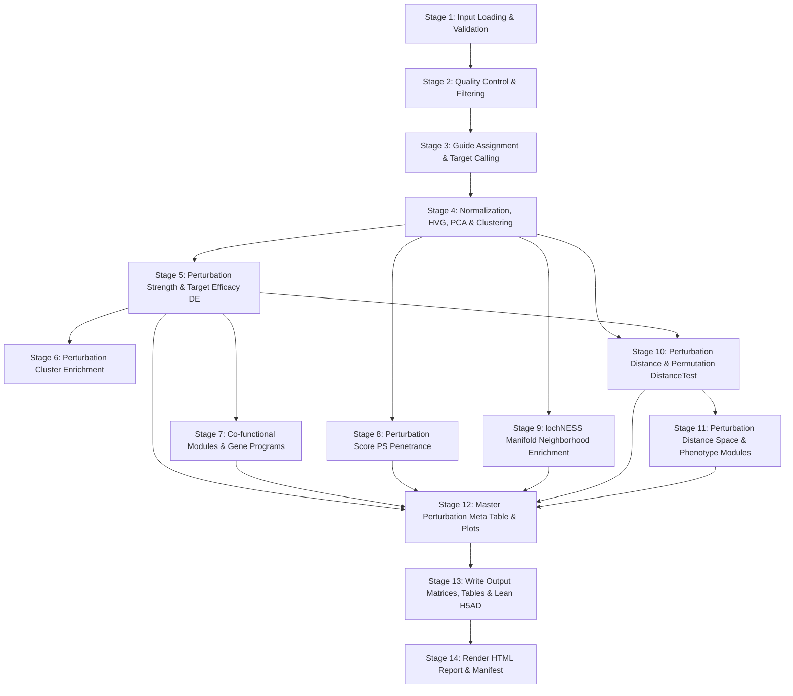

# Perturb-seq Analysis Pipeline: Scientific & Technical Architecture

## 1. Scientific Philosophy & Analytical Framework

The goal of this pipeline is to provide a statistically rigorous, highly scalable, and biologically interpretable end-to-end framework for Perturb-seq data analysis.

Rather than aggregating disparate methods into arbitrary composite scores, the pipeline is architected around orthogonal biological dimensions answering distinct questions along the perturbation cascade:

$$\text{Perturbation} \longrightarrow \text{Efficacy} \longrightarrow \text{Penetrance} \longrightarrow \text{Phenotype Magnitude} \longrightarrow \text{Topology} \longrightarrow \text{Phenotype Similarity} \longrightarrow \text{Mechanistic Organization}$$

| Biological Dimension | Pipeline Stage | Primary Question | Key Metrics / Methods |
|---|---|---|---|
| **Efficacy** (Target Knockdown) | Stage 5 | Did the guide effectively deplete the targeted transcript? | $\log_2\text{FC}$, KS-test FDR, `% knockdown` |
| **Penetrance** (Per-Cell Response) | Stage 8 | What fraction of perturbed cells shifted into a transcriptionally distinct state? | Perturbation Score (PS), responder fraction, escaper fraction |
| **Phenotype Magnitude** (Global Displacement) | Stage 10 | How far is the high-dimensional cell distribution displaced from unperturbed control? | **Energy Distance** ($E$-distance), MMD, permutation **DistanceTest** FDR |
| **Manifold Topology** (Local Density Shift) | Stage 9 | Where does the perturbation concentrate on the single-cell phenotypic manifold? | **lochNESS** neighborhood enrichment, peak score, cluster enrichment |
| **Phenotype Similarity** (Distance Space) | Stage 11 | Which perturbations produce similar global phenotypes in embedding space? | Pairwise Energy Distance matrix, PCoA coordinates, $k$-NN ranking |
| **Mechanistic Organization** (Modules) | Stages 7 & 11 | How do perturbations cluster into functional modules and gene programs? | **Co-functional Modules** (shared DE targets) & **Phenotype Modules** (distance-space clusters) |

---

## 2. Perturbation Distance & DistanceTest (Stage 10)

### 2.1 Why Energy Distance?
Single-cell perturbation profiles are high-dimensional probability distributions $P$ and $Q$.
* **Energy Distance** ($E$-distance / `edistance`): A non-parametric, rotation-invariant statistical distance between two multivariate distributions based on Euclidean distances between sample points:
  $$D^2(P, Q) = 2\,\mathbb{E}_{X \sim P, Y \sim Q}[\|X - Y\|_2] - \mathbb{E}_{X, X' \sim P}[\|X - X'\|_2] - \mathbb{E}_{Y, Y' \sim Q}[\|Y - Y'\|_2]$$
  Energy distance is zero if and only if $P = Q$. Unlike mean centroid Euclidean distance, Energy Distance captures higher-order moments (spread, shape, variance, multimodality).
* **Maximum Mean Discrepancy (MMD)** (`mmd`): An optional secondary non-parametric metric evaluated in a Reproducing Kernel Hilbert Space (RKHS) using a Gaussian RBF kernel with median-heuristic bandwidth:
  $$\text{MMD}^2(P, Q) = \mathbb{E}[k(X, X')] - 2\,\mathbb{E}[k(X, Y)] + \mathbb{E}[k(Y, Y')]$$

### 2.2 Finite-Permutation DistanceTest
To determine whether a perturbation induces a statistically significant phenotypic shift vs control:
1. **Bounded Sampling**: If cell counts exceed bounds, deterministic sampling is performed:
   * Target cells: up to `max_cells_per_target` (default: 2,000).
   * Control cells: up to `max_control_cells` (default: 5,000).
   * Sampling is deterministic with `random_seed: 123` and optionally stratified by `stratify_by` (e.g. `lane_id`).
2. **Precomputed Distance Matrix & Vectorized Permutations**:
   Let pooled sample $Z = [X; Y]$ have size $N = n + m$. The pairwise Euclidean distance matrix $D \in \mathbb{R}^{N \times N}$ is computed once.
   Using the algebraic identity:
   $$2 \sum_{i \in I, j \in J} D_{ij} = \sum_{a, b} D_{ab} - \sum_{i, i' \in I} D_{ii'} - \sum_{j, j' \in J} D_{jj'}$$
   each permutation partition of labels evaluates in $O(n^2 + m^2)$ matrix slicing without recomputing Euclidean distances.
3. **Exact Finite-Permutation Empirical P-value**:
   $$p = \frac{1 + \sum_{b=1}^B \mathbf{1}(D_{\text{perm}, b} \ge D_{\text{observed}})}{1 + B}$$
4. **Multiple Testing Correction**: Benjamini–Hochberg False Discovery Rate (FDR) is applied across all tested targets. Targets with $\text{FDR} < 0.05$ (configurable) are flagged as significant phenotypic hits.

---

## 3. Perturbation Distance Space & Phenotype Modules (Stage 11)

### 3.1 Pairwise Distance Matrix
A target $\times$ target symmetric matrix $D \in \mathbb{R}^{K \times K}$ is constructed using pairwise Energy Distance between each pair of perturbations (with $D_{ii} = 0$).
* The distance matrix is saved **outside the H5AD** as a tab-separated table (`tables/perturbation_distance_matrix.tsv`) to prevent `.uns` bloat and ensure fast downstream re-use.

### 3.2 Principal Coordinate Analysis (PCoA / Classical MDS)
To project high-dimensional perturbation distances into low-dimensional Euclidean coordinates:
1. Double-centering of squared distance matrix: $B = -\frac{1}{2} H D^2 H$, where $H = I - \frac{1}{K} \mathbf{1}\mathbf{1}^T$.
2. Eigendecomposition: $B = V \Lambda V^T$.
3. Non-Euclidean spectral regularization: Negative eigenvalues arising from sample-level empirical distances are truncated ($\lambda_i > 10^{-10}$).
4. Coordinate embedding: $X_{\text{PCoA}} = V_+ \Lambda_+^{1/2}$. Coordinates are saved to `tables/perturbation_space_coordinates.csv`.

### 3.3 Nearest Phenotypic Neighbors
For each perturbation, the top-$k$ nearest neighbors in phenotypic distance space are ranked and saved to `tables/perturbation_neighbors.csv`.

### 3.4 Phenotype Modules vs Co-functional Modules
The pipeline explicitly maintains two distinct, non-overlapping modular classifications:
1. **Co-functional Modules** (`Stage 7`, `tables/cofunctional_modules.csv`): Discovered from shared differential expression effect profiles ($\log_2\text{FC}$ across target genes). Answer: *Which perturbations regulate the same downstream target genes?*
2. **Phenotype Modules** (`Stage 11`, `tables/phenotype_modules.csv`): Discovered via hierarchical clustering (e.g. average linkage) directly on the high-dimensional PCA phenotypic Energy Distance matrix. Answer: *Which perturbations induce geometrically similar whole-cell transcriptional states?*

---

## 4. Master Perturbation Meta Table (`tables/perturbation_meta.csv`)

The master table consolidates all orthogonal layers into a unified reference matrix across all tested perturbations:

| Column | Source Stage | Description |
|---|---|---|
| `target_gene` | Metadata | Perturbation target identifier |
| `n_cells` | Stage 3 / QC | Number of guide-assigned cells passing QC |
| `target_log2fc` | Stage 5 | Log2 fold change of target transcript vs primary control |
| `target_pct_kd` | Stage 5 | Percentage knockdown of target transcript |
| `target_fdr` | Stage 5 | KS-test FDR for target transcript depletion |
| `is_effective_hit` | Stage 5 | Binary flag: statistically effective knockdown |
| `ps_mean` | Stage 8 | Mean Perturbation Score (penetrancy) |
| `ps_median` | Stage 8 | Median Perturbation Score |
| `ps_responder_fraction` | Stage 8 | Fraction of cells with successful phenotypic shift |
| `ps_escaper_fraction` | Stage 8 | Fraction of cells unperturbed / escaping phenotype |
| `lochness_mean` | Stage 9 | Mean lochNESS neighborhood enrichment score |
| `lochness_peak` | Stage 9 | Maximum lochNESS score across cell neighborhoods |
| `lochness_pct_enriched` | Stage 9 | Percentage of cells located in enriched manifold zones |
| `energy_distance` | Stage 10 | High-dimensional Energy Distance vs unperturbed control |
| `mmd_distance` | Stage 10 | RKHS Maximum Mean Discrepancy vs control (if enabled) |
| `distance_pvalue` | Stage 10 | Empirical finite-permutation DistanceTest p-value |
| `distance_fdr` | Stage 10 | Benjamini–Hochberg FDR on permutation DistanceTest |
| `distance_significant` | Stage 10 | Binary flag: significant phenotypic displacement |
| `cofunctional_module` | Stage 7 | Co-functional module assignment (shared DE profile) |
| `phenotype_module` | Stage 11 | Phenotype module assignment (distance-space cluster) |

> **Architectural Invariant**: The pipeline **never** computes an arbitrary composite "master score". Target efficacy, penetrance, manifold topology, and phenotypic distance represent distinct, non-fungible biological questions.

---

## 5. Pipeline Stages Execution Flow (1-14)



---

## 6. Output Table & File Manifest

| File Path | Format | Description |
|---|---|---|
| `processed.h5ad` | H5AD | Lean single-cell object containing cell-level embeddings and scores in `.obs`/`.obsm` |
| `tables/perturbation_distance.csv` | CSV | Target-level Energy Distance, MMD, p-value, and FDR vs control |
| `tables/perturbation_distance_matrix.tsv` | TSV | Pairwise target $\times$ target phenotypic Energy Distance matrix (**outside H5AD**) |
| `tables/perturbation_space_coordinates.csv` | CSV | PCoA coordinates ($X_{\text{PCoA}, 1}, X_{\text{PCoA}, 2}, \dots$) for all perturbations |
| `tables/perturbation_neighbors.csv` | CSV | Top-$k$ nearest phenotypic neighbors for each perturbation |
| `tables/phenotype_modules.csv` | CSV | Phenotype module cluster assignments |
| `tables/perturbation_meta.csv` | CSV | Unified master reference table across all biological dimensions |
| `figures/perturbation_atlas.png` | PNG | Perturbation Atlas heatmap showing Z-scored efficacy, PS, lochNESS, and distance |
| `figures/ps_vs_distance_map.png` | PNG | PS penetrance $\times$ Energy Distance scatter plot with lochNESS point sizing |
| `figures/perturbation_phenotype_space.png` | PNG | PCoA projection colored by Phenotype Modules and continuous metrics |
| `figures/module_concordance.png` | PNG | Cross-tabulation heatmap between co-functional and phenotype modules with ARI & NMI |
| `report.html` | HTML | Standalone interactive report incorporating all 14 stages and report cards |

---

## 7. Configuration Reference

```yaml
distance:
  enabled: true                    # Enable/disable perturbation distance analysis
  representation: X_pca            # Latent representation in adata.obsm (e.g. X_pca, X_pca_harmony)
  primary_metric: edistance        # Primary statistical distance metric ('edistance')
  secondary_metric: mmd            # Optional secondary metric ('mmd' or null)
  min_cells: 30                    # Minimum cells required per perturbation to test
  max_cells_per_target: 2000       # Maximum cells sampled per perturbation (bounded computation)
  max_control_cells: 5000          # Maximum control cells sampled for baseline comparison
  n_permutations: 1000             # Permutations for exact empirical p-value computation
  random_seed: 123                 # Deterministic seed for sampling and permutation testing
  fdr_threshold: 0.05              # Multiple-testing significance threshold
  stratify_by: null                # Optional column in obs to stratify sampling (e.g. 'lane_id')

distance_space:
  enabled: true                    # Enable/disable pairwise perturbation distance space
  metric: edistance                # Metric for pairwise matrix computation ('edistance' or 'mmd')
  representation: X_pca            # Embedding in obsm
  n_components: 10                 # Number of PCoA dimensions to compute
  nearest_neighbors: 10            # Number of nearest neighbors to record per perturbation
  clustering: true                 # Hierarchical clustering into phenotype modules
  n_modules: null                  # Number of phenotype clusters (null = dynamic silhouette/distance cut)
  cluster_distance_threshold: null # Distance threshold for dendrogram cut
  linkage_method: average          # Linkage method for hierarchical clustering ('average', 'complete', 'ward')
  min_cells: 30                    # Minimum cells per perturbation to include in distance space
  max_cells_per_target: 2000       # Cell sampling cap
  random_seed: 123                 # Deterministic seed

meta_analysis:
  enabled: true                    # Build tables/perturbation_meta.csv

visualization:
  perturbation_atlas: true         # Generate figures/perturbation_atlas.png
  ps_distance_map: true            # Generate figures/ps_vs_distance_map.png
  perturbation_space: true         # Generate figures/perturbation_phenotype_space.png
  module_concordance: true         # Generate figures/module_concordance.png
  atlas_top_n: 50                  # Number of top perturbations featured in heatmap overview
```

---

## 8. Scalability & Memory Architecture

* **STANDARD vs LARGE Mode Execution**:
  * In standard mode, exact vectorized routines run seamlessly in memory.
  * In large mode ($> 1\text{M}$ cells), bounded sampling limits Euclidean operations to $N \le 7,000$ cells per target, ensuring permutation testing executes in $< 10\text{ ms}$ per perturbation.
* **Lean H5AD Storage Policy**:
  * H5AD files strictly store cell-level vectors in `.obs` / `.obsm`.
  * Pairwise target distance matrices ($K \times K$), nearest-neighbor tables, and master meta tables reside in `tables/` outside `.uns` to eliminate H5AD bloat and memory overhead.
