# Diabetes Progenitor Study

**From Perturbation Prediction to Quantitative Perturbation Biology**

*Decomposing the phenotypes of 36 diabetes-gene perturbations across human pancreatic differentiation*

Scientific audit and synthesis of the `diabetes_specific` analysis programme
**PertTF-Virtual-Challeng-Weilab / perturbseq-pipeline**
branch `dev` · analysis run 19816263 (2026-08-30) · report compiled 2026-09-01

> **About this file**
>
> This is the canonical Markdown edition of `PertTF_Diabetes_Quantitative_Perturbation_Biology_Report.docx`, which remains the authoring source and stays local to `results/diabetes_specific/`. The conversion is faithful: section order, numbering, tables, figures, captions, interpretations and status labels are those of the Word report. Only presentation changed — headings were demoted one level so the document has a single title, the Word callout boxes became blockquotes, and the 21 embedded figures were written to `./report_figures/` and are referenced by relative path.
>
> Every figure in `report_figures/` was verified byte-identical (MD5) to the pipeline output named in its own caption; `report_figures/PROVENANCE.md` records the mapping. The report's quantitative claims were re-checked against the current tables in `results/diabetes_specific/tables/` during conversion and reproduce exactly, including the partial-correlation analysis of Section 10.2, the composition correlation of Section 9.3 and the enrichment counts of Section 8.3. One count in Appendix A.3 was corrected and is flagged inline there.

---

## 1. Executive summary

pertTF established that perturbation responses in this system can be learned and predicted — expression vectors, cell-type identity, genotype identity, and continuous lochNESS composition shifts, including for cell contexts and genes withheld from training. Prediction accuracy, however, does not by itself tell a biologist how strongly individual cells respond, whether the response is uniform, where on the developmental manifold it occurs, how far the cell population has moved, or which transcriptional programmes generate the phenotype. The diabetes_specific programme was built to answer those questions on the same 111,581-cell pancreatic differentiation dataset that pertTF was trained on.

The completed run (21.4 min, 48 CPUs, job 19816263) applies five quantitative readouts to 36 non-WT genotypes: per-cell perturbation score (PS), continuous lochNESS state-space localisation, permutation-tested energy distance from WT, Cochran–Mantel–Haenszel cell-state enrichment stratified by sample, and a co-functional module / gene-programme decomposition. It emits 28 result-table files, 28 primary figures and 98 per-genotype panels. Nothing in the run failed. [*Corrected during Markdown conversion: the Word report reads '40 result tables'. `results/diabetes_specific/tables/` holds 28 CSV files, of which 25 are distinct by content — `distance_test.csv`, `lochness_by_genotype_celltype.csv` and `lochness_celltype_summary.csv` are alias copies of `distance_results.csv`, `lochness_by_celltype.csv` and `lochness_by_celltype2.csv`. 40 is the number of PNG files at the top level of `figures/` (28 numbered primaries plus 12 alias copies).*]

### What the data show

-   Every perturbation produces a statistically detectable population phenotype. All 36 genotypes reach the permutation floor of the DistanceTest (FDR = 0.000999, 1,000 permutations); energy distance from WT spans a 13-fold range, 1.08 (MNX1) to 13.63 (PDX1het).

-   Response strength is profoundly cell-state dependent, and this is the central result. PDX1 loss is transcriptionally silent in progenitors (median PS = 0.00 in ESC, DE, PFG and PP) yet nearly fully penetrant in SC-EC (0.85) and SC-beta (0.72). TLE3 has the lowest genotype-level median PS in the dataset (0.164) and a median PS of 1.00 in SC-beta. A single number per genotype actively conceals the biology.

-   lochNESS localises each perturbation to specific cell states and recovers the known lineage diversions: GATA6 to Endothelial (mean self-lochNESS +31.0 over 386 cells), FOXA2 to Liver (+13.7 over 1,667 cells), PDX1 to SC-EC (+9.8 over 1,576 cells) and PDP (+11.2), PAX6 to SC-EC (+8.3), TLE3 to SC-alpha (+8.2).

-   Cell-state enrichment against other perturbed cells is significant for 313 of 540 genotype x cell-state pairs (118 enriched, 195 depleted), including the developmental blocks expected from the biology: NEUROG3 and BMPR1A produce zero SC-beta cells (log2 OR -6.54 and -5.79).

-   The three metrics are not interchangeable, but neither are they as independent as an earlier internal reading concluded. PS and lochNESS are genuinely uncorrelated across genotypes (Spearman rho = +0.06, p = 0.77). PS and energy distance appear strongly coupled (rho = +0.64, p = 4.2e-4) — but that coupling is largely a shared dependence on cell-state composition, and does not survive conditioning on it (partial rho = +0.37, p = 0.063). This is documented in Section 10 and is the most consequential correction this audit makes.

-   Four unsupervised gene programmes recovered from the 36 x 980 perturbation effect matrix map onto recognisable biology: P3 is a MYC-target/translation programme (OR 105, FDR 3.5e-36) active in ESC and DE; P2 carries the Hallmark Pancreas Beta Cells signature (FDR 1.3e-3) and peaks in endocrine states; P4 is EMT/angiogenesis (FDR 1.5e-4) and is specific to the Endothelial compartment.

### What this adds to pertTF

pertTF answers ***what is likely to happen*** after perturbation X. The analyses audited here answer four further questions on the same data: ***how strong*** the response is per cell, ***how uniform*** it is within a genotype, ***where*** on the developmental manifold it occurs, and ***which programmes*** carry it. Each of those is now a measured, per-genotype x per-cell-state quantity rather than an implicit property of a latent vector. The practical consequence is a concrete proposal (Section 17): the state-resolved PS and lochNESS matrices are supervision targets pertTF does not currently use.

### Principal caveats, stated up front

-   The WT reference is structurally non-matched. 24,408 of the 32,693 WT cells (74.7%) come from six WT-only samples that contain no perturbed cells; the seven perturbation samples contribute the remaining 8,285 co-cultured WT cells. Any WT-referenced comparison is therefore partly a between-sample comparison.

-   Energy distance from WT is dominated by cell-state composition, not by within-state transcriptional magnitude (Spearman rho = +0.88 with the dominant-cell-state fraction, p = 9.5e-13). Read it as "how differently is this genotype distributed across the manifold", not as "how strong is the response".

-   Ten of 36 genotypes have no PS score at all — heterozygotes, enhancer deletions and compound knockouts whose labels are not gene symbols in the expression matrix. This is a gene-name lookup failure, not an absence of phenotype; PDX1het has the largest energy distance in the dataset.

-   The lochNESS summaries are self-scores and are bounded below at -1, so they can express enrichment without bound but cannot express the magnitude of depletion. The reported decoupling of "negative lochNESS" from everything else is at least partly a floor effect (Section 10).

-   Co-functional module clustering is degenerate: 29 of 36 perturbations fall in module M1, and the M-numbering is not stable between the two runs of the same data. Module-level biological labels used in earlier internal documents are not supported (Appendix C).

## 2. Biological motivation: what remains after prediction

### 2.1 The scientific lineage of this project

Three bodies of work stack here, and the repository contains material from all three (results/diabetes_specific/presentation/Presentation_Sep1/).

The precursor study (pertTF-precussor.pdf; internal reading precursor_scientific_reading.md) built a "stem-cell knockout village": 79 barcoded, genotype-verified clonal hPSC knockout lines targeting 30 pancreatic lineage regulators and diabetes genes, pooled and co-cultured with unlabelled WT cells and differentiated through the standard ESC to DE to PFG to PP to SC-islet protocol. Its findings define the biology this report is measuring against: PDX1, RFX6, PAX6, NEUROD1 and GLIS3 knockouts collapse SC-beta yield; arrested cells do not die but divert — GATA6 to endothelium, FOXA2 to hepatic progenitors, HHEX to primitive gut tube; and loss of RFX6, PDX1 or PAX6 converts the endocrine compartment into serotonergic enterochromaffin-like SC-EC cells.

pertTF (pertTF.pdf; internal reading pertTF_scientific_reading.md) turned that dataset into a context-aware transformer with perturbation-token adapters, negative-binomial reconstruction loss and supervised contrastive learning. It classifies cell type and genotype, predicts expression under held-out gene and held-out cell-context regimes, predicts continuous lochNESS composition shifts, transfers to CRISPRi and to primary human islets, and supports in-silico genome-scale screens. Its headline benchmarks are catalogued with verification status in Quantitative_Claim_Audit.md.

The work audited here is the third layer, and it is explicitly ***not*** part of the pertTF manuscript. Energy distance, DistanceTest, DistanceSpace and the co-functional module decomposition were introduced afterwards (stated in WIP_scientific_reading.md, Section 1). Their purpose is to characterise the phenotype that pertTF predicts.

### 2.2 Why prediction accuracy leaves the phenotype under-described

A model that predicts a perturbed expression vector with cosine similarity 0.9 has compressed several distinct biological facts into one latent shift. Consider two genotypes that could produce the same predicted mean vector: one in which 90% of cells shift slightly, and one in which 20% of cells shift completely while the rest are indistinguishable from control. These are different phenotypes with different mechanisms — incomplete penetrance versus a hard developmental gate — and different experimental follow-ups. They are also, in this dataset, real: GATA6 has an interquartile PS range of 0.25 (uniform response) while TLE3 has an interquartile range of 0.89 spanning almost the entire scale (Section 7.3).

The decomposition pursued here separates properties that a single predicted vector conflates:

-   Penetrance — what fraction of perturbed cells actually depart from the control state (PS).

-   Homogeneity — whether the responding cells form one population or two (PS distribution shape).

-   Localisation — which regions of the developmental manifold the perturbed cells occupy or vacate (lochNESS, cell-state enrichment).

-   Displacement — how far the perturbed population sits from the reference distribution (energy distance).

-   Programme content — which coordinated sets of genes carry the change (effect-matrix modules and programmes).

> **The framing question this report tests**
>
> The brief for this audit proposed a chain: perturbation to response strength to cell-state specificity to state-space displacement to transcriptional programmes to phenotype. The evidence supports most of that chain, but with one important rearrangement. Cell-state specificity is not a consequence of response strength — it is the variable that governs it. PS measured per genotype x per cell state (Section 8) is a far more informative object than PS measured per genotype (Section 7), and energy distance measured against a compositionally matched reference is a different quantity from the one currently computed (Section 9). The chain is better read as: cell state gates response strength; response strength and localisation together define displacement; programmes explain the direction of travel.

## 3. Dataset and experimental context

### 3.1 Composition

**Table 1.** Dataset dimensions as validated at the start of the analysis run. *Source: workflows/results/diabetes_specific/logs/diabetes_analysis_19816263.err*

| **Property**                               | **Value**                                              | **Source**                                |
|--------------------------------------------|--------------------------------------------------------|-------------------------------------------|
| Cells                                      | 111,581                                                | run log 19816263                          |
| Genes / features                           | 36,601                                                 | run log                                   |
| Samples (obs['orig.ident'])              | 13                                                     | assignment_per_lane.csv                 |
| Genotypes (obs['genotype'])              | 37 (WT + 36 perturbations)                             | run log                                   |
| WT (control) cells                         | 32,693 (29.3%)                                         | guide_assignment.csv                     |
| Perturbed cells                            | 78,888 (70.7%)                                         | guide_assignment.csv                     |
| Distinct sgRNA / construct IDs             | 100                                                    | run log                                   |
| Curated cell states (obs['celltype_2']) | 15                                                     | run log                                   |
| Derived differentiation stages             | 6 (WT, ESC, DE, PFG, PP, 3DEC)                         | STAGE_MAPPING, diabetes_analysis.py:133 |
| Expression representation                  | 50-PC PCA on 3,000 HVGs; pre-existing X_umap retained | run log 13:23:03–13:23:22                 |

The 15 curated cell states span the intended differentiation trajectory (ESC, ESC (D3), DE, PFG, PGT, PP, PDP, EnP, SC-EC, SC-alpha, SC-beta, SC-delta) plus three off-target or supporting fates (Liver, Stromal, Endothelial). The presence of the latter three as annotated states is itself a design decision that matters: it is what allows the lineage-diversion phenotypes to be quantified rather than appearing as unassigned cells.

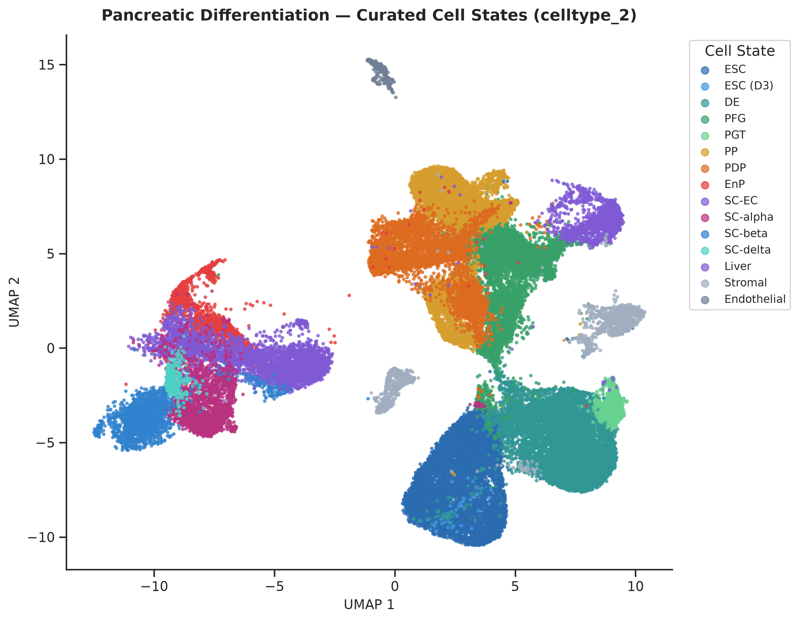

**Figure 1.** UMAP of all 111,581 cells coloured by curated cell state (celltype_2). Coordinates are the pre-existing X_umap in the input object; a 50,000-cell random subsample is plotted (seed 123). Axes are arbitrary UMAP units. *Source: results/diabetes_specific/figures/01_umap_celltype2.png*

**Interpretation.** The manifold has the topology the experiment was designed to produce: a pluripotent-to-progenitor arm (ESC, bottom centre, into DE, PFG and PP/PDP, upper centre) and a separate endocrine island (left) containing SC-beta, SC-alpha, SC-delta, SC-EC and EnP. Three fates sit off the main trajectory — a small isolated Endothelial island (top), and Stromal and Liver territories to the right of the progenitor arm. Because these off-trajectory fates occupy discrete, well-separated regions, a perturbation that redirects cells into them produces a large and unambiguous signal in every metric used below. Note one figure defect: SC-EC and Liver are assigned the same hex colour (#805ad5) in CELLTYPE_PALETTE, so the two purple territories cannot be told apart from the legend alone.

### 3.2 Sample design, and why it constrains every WT comparison

**Table 2.** Perturbed and WT cell counts per sample. Six samples contain WT cells only. *Source: results/diabetes/tables/assignment_per_lane.csv*

| **Sample**         | **Perturbed cells** | **WT cells** | **Total** | **% perturbed** | **% WT** |
|--------------------|---------------------|--------------|-----------|-----------------|----------|
| Sample_A_WT      | 0                   | 2463         | 2463      | 0.0             | 100.0    |
| Sample_B_WT      | 0                   | 9869         | 9869      | 0.0             | 100.0    |
| Sample_C_WT      | 0                   | 2492         | 2492      | 0.0             | 100.0    |
| Sample_D_WT      | 0                   | 3155         | 3155      | 0.0             | 100.0    |
| Sample_E_WT      | 0                   | 2767         | 2767      | 0.0             | 100.0    |
| Sample_F_WT      | 0                   | 3662         | 3662      | 0.0             | 100.0    |
| Sample_G_1_ESC  | 6205                | 323          | 6528      | 95.1            | 4.9      |
| Sample_G_2_ESC  | 8801                | 531          | 9332      | 94.3            | 5.7      |
| Sample_H_DE      | 17029               | 1091         | 18120     | 94.0            | 6.0      |
| Sample_I_PFG     | 16374               | 1290         | 17664     | 92.7            | 7.3      |
| Sample_J_PP      | 9220                | 1166         | 10386     | 88.8            | 11.2     |
| Sample_L_1_3DEC | 10423               | 1920         | 12343     | 84.4            | 15.6     |
| Sample_L_2_3DEC | 10836               | 1964         | 12800     | 84.7            | 15.3     |

**This table is the single most important structural fact about the dataset.** Samples A–F are pure WT (24,408 cells, 0% perturbed). The perturbation samples (G, H, I, J, L) are 84–95% perturbed and carry 8,285 co-cultured WT cells between them. WT is therefore not evenly co-resident with the perturbations it is used to control for.

Two consequences run through the whole report. First, the cell-state enrichment test is stratified by sample using a Cochran–Mantel–Haenszel statistic across 13 strata; six of those strata contain no perturbed cells and contribute nothing, so the effective WT reference for a stratified test is only the 8,285 co-cultured cells. Second, the WT population used for energy distance is compositionally unlike any single perturbation: it pools a longitudinal WT time course (obs['time_point'] D-1 to D25 exists only for the 24,408 WT-only cells; the other 87,173 cells are annotated NA) with WT cells drawn from every differentiation stage.

**Table 3.** Cells per differentiation stage for WT and for genotypes discussed in this report. The 'WT' stage column is the six WT-only samples. *Source: recomputed from results/diabetes_specific/diabetes_analysis.h5ad (obs)*

| **Genotype** | **3DEC** | **DE** | **ESC** | **PFG** | **PP** | **WT** |
|--------------|----------|--------|---------|---------|--------|--------|
| WT           | 3884     | 1091   | 854     | 1290    | 1166   | 24408  |
| GATA6        | 90       | 519    | 344     | 384     | 163    | 0      |
| FOXA2        | 318      | 1024   | 775     | 2469    | 310    | 0      |
| PDX1         | 3570     | 648    | 801     | 594     | 594    | 0      |
| PDX1het      | 7        | 31     | 410     | 17      | 4      | 0      |
| PAX6         | 1113     | 450    | 410     | 648     | 616    | 0      |
| TLE3         | 1710     | 401    | 246     | 493     | 409    | 0      |
| NEUROD1      | 1133     | 497    | 324     | 440     | 334    | 0      |
| GLIS3        | 43       | 152    | 596     | 89      | 55     | 0      |
| KDM2B        | 5        | 64     | 94      | 14      | 5      | 0      |
| HHEXhet      | 6        | 151    | 138     | 28      | 5      | 0      |

*All 36 perturbations are represented at all five differentiation stages, but the balance varies by more than an order of magnitude: PDX1het contributes 410 of its 469 cells (87.4%) at the ESC stage and only 7 at 3DEC, whereas PDX1 contributes 3,570 of 6,207 (57.5%) at 3DEC.*

This imbalance is not a data-quality problem — for a line that arrests early it is the phenotype. It does, however, mean that population-level distance from a compositionally mixed WT reference measures arrest as much as it measures transcriptional derangement. Section 9.3 quantifies exactly how much.

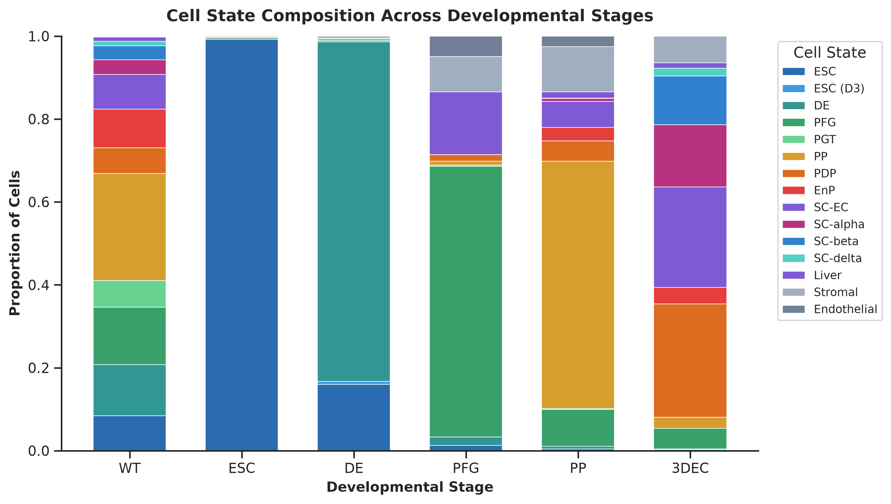

**Figure 2.** Stacked cell-state composition of each derived differentiation stage. x-axis: differentiation stage (WT = the six WT-only samples; ESC/DE/PFG/PP/3DEC = the perturbation samples). y-axis: proportion of cells. Colour: curated cell state. *Source: results/diabetes_specific/figures/03_stage_celltype_composition.png*

**Interpretation.** The staged samples behave as intended — ESC is ~99% ESC cells, DE ~83% DE, PFG ~65% PFG, PP ~59% PP, and 3DEC is the mixed endocrine/ductal endpoint (PDP, SC-EC, SC-alpha, SC-beta, EnP, Stromal). The leftmost bar is the important one: the WT-only samples are a mixture of every stage at once. That mixture, not a stage-matched population, is what the energy-distance test compares each perturbation against.

## 4. Analysis workflow

The bespoke workflow workflows/diabetes_analysis.py orchestrates validated algorithms imported from src/perturbseq_pipeline/ without reimplementing them. It writes each table to disk immediately after the stage that produces it, so a failure in figure generation cannot destroy analytical output; figures are additionally wrapped in safe_generate_figure so that one broken panel does not abort the rest.

**Table 4.** Executed workflow. All nine steps completed; the run log records 28/28 figures generated, 0 failed. *Source: workflows/diabetes_analysis.py; run log 19816263*

| **Step** | **Stage**             | **Biological question**                                        | **Method**                                                         | **Primary output**                                                         |
|----------|-----------------------|----------------------------------------------------------------|--------------------------------------------------------------------|----------------------------------------------------------------------------|
| 0        | Load & validate       | Are the required annotations present and consistent?           | obs-column check; count report                                     | run log                                                                    |
| 1        | Prepare               | What geometry will everything be measured in?                  | development_stage from orig.ident; 3,000 HVGs; 50-PC PCA          | X_pca, X_umap, development_stage                                        |
| 2        | PS score              | How strongly does each individual cell respond?                | pertps 0.1.0 (scMAGeCK-style signature projection), PS in [0,1]  | ps_score_summary.csv, ps_by_\* (4 tables)                              |
| 3        | lochNESS              | Where on the manifold does each perturbation accumulate?       | k=300 neighbour graph on X_pca; local/global label-fraction ratio | lochness_summary.csv, lochness_by_\* (5 tables)                         |
| 4        | DistanceTest          | Has the population moved detectably from WT?                   | Energy distance in X_pca; 1,000-permutation test; BH FDR          | distance_results.csv / distance_test.csv                                 |
| 5        | DistanceSpace         | Which perturbations produce similar phenotypes?                | 36x36 pairwise energy distance; PCoA; average-linkage groups       | distance_space_matrix.csv, _coordinates, _neighbors, phenotype_groups |
| 6        | Cell-state enrichment | Which cell states are over- or under-represented?              | Cochran-Mantel-Haenszel stratified by orig.ident (13 strata)       | celltype_enrichment.csv                                                   |
| 7        | Modules & programmes  | Which coordinated gene sets carry the effect?                  | log2FC effect matrix vs control; correlation clustering; ORA       | module_assignments, gene_programs, program_\* (4 tables)                |
| 8        | Integrate             | Can each genotype be described by several coordinates at once? | Master 37 x 27 summary table; cross-metric correlations            | perturbation_summary.csv; Figures 05-19                                   |

**Table 5.** Effective parameters for the completed run. *Source: workflows/run_diabetes_analysis.slurm; run_diabetes_workflow(); run log*

| **Parameter**                      | **Value**                                                           | **Set in**                       |
|------------------------------------|---------------------------------------------------------------------|----------------------------------|
| seed                               | 123                                                                 | CLI --seed                       |
| n_jobs                            | 48                                                                  | CLI --n-jobs                     |
| HVGs / PCs                         | 3,000 / 50                                                          | Config defaults                  |
| PS min cells per target            | 10                                                                  | CLI --min-cells                  |
| lochNESS k / representation        | 300 / X_pca (50 PC)                                                | Config defaults                  |
| DistanceTest permutations          | 1,000                                                               | CLI --n-permutations             |
| DistanceTest cell caps             | 2,000 per target; 5,000 control                                     | CLI                              |
| Enrichment stratification          | orig.ident (13 strata)                                              | diabetes_analysis.py:4280       |
| Enrichment primary control         | 'other' (all other perturbed cells) — pipeline default, NOT WT      | Config() default CONTROL_OTHER  |
| Distance control                   | 'ntc' = WT (32,693 available, 5,000 sampled)                        | distance stage                   |
| Modules: gene set                  | top 100 celltype_2 Wilcoxon markers per state (980 genes retained) | Config defaults                  |
| Modules / programmes               | 6 / 4                                                               | CLI --n-modules/--n-programs     |
| Min-cell rule for plotted matrices | cells with <10 observations masked (grey)                        | diabetes_analysis.py:3609, 3691 |

*The enrichment primary control deserves attention. config/diabetes.yaml sets enrichment.primary_control: ntc, but that YAML configures the generic pipeline (results/diabetes/). The bespoke workflow builds a fresh Config() and does not override primary_control, so it inherits CONTROL_OTHER. Both comparisons are computed and written to celltype_enrichment.csv; only the 'other' rows are flagged significant. Section 8.3 reports both.*

## 5. Data quality and perturbation QC

Before any genotype-specific difference can be interpreted as biology, three things must be true: the cells being compared must be of comparable technical quality; each genotype must be represented by enough cells in the states where it is scored; and the perturbations must be what they claim to be. Each is checked below.

### 5.1 Cell-level quality

**Table 6.** Per-sample cell-quality metrics after (unchanged) QC. *Source: results/diabetes/tables/qc_summary.csv*

| **Sample**         | **Cells** | **Median genes** | **Median UMIs** | **Median %MT** | **Median %ribo** |
|--------------------|-----------|------------------|-----------------|----------------|------------------|
| Sample_A_WT      | 2463      | 4154.0           | 4170.05         | 0.67           | 5.74             |
| Sample_B_WT      | 9869      | 3530.0           | 3996.4          | 0.89           | 4.58             |
| Sample_C_WT      | 2492      | 3879.0           | 4064.85         | 0.69           | 5.93             |
| Sample_D_WT      | 3155      | 3318.0           | 3908.99         | 0.73           | 6.1              |
| Sample_E_WT      | 2767      | 4201.0           | 4183.79         | 0.65           | 5.81             |
| Sample_F_WT      | 3662      | 3264.5           | 3899.97         | 0.65           | 6.08             |
| Sample_G_1_ESC  | 6528      | 3888.5           | 3878.8          | 0.97           | 6.72             |
| Sample_G_2_ESC  | 9332      | 3190.0           | 3682.21         | 1.02           | 7.03             |
| Sample_H_DE      | 18120     | 3419.5           | 3907.6          | 0.71           | 6.36             |
| Sample_I_PFG     | 17664     | 2900.0           | 3572.66         | 0.72           | 7.15             |
| Sample_J_PP      | 10386     | 3395.5           | 3940.52         | 0.67           | 5.63             |
| Sample_L_1_3DEC | 12343     | 3791.0           | 3963.96         | 0.96           | 5.27             |
| Sample_L_2_3DEC | 12800     | 3378.0           | 3811.87         | 1.0            | 5.51             |
| ALL                | 111581    | 3449.0           | 3866.67         | 0.82           | 6.18             |

Quality is uniform and high. Median genes per cell ranges 2,900 (Sample_I_PFG) to 4,201 (Sample_E_WT), a 1.45-fold spread; median mitochondrial content is 0.65–1.02% in every sample, an order of magnitude below the thresholds usually applied to droplet scRNA-seq. Ribosomal content is 4.6–7.2%.

**The pipeline applied no filtering of its own**: qc_steps.csv records 111,581 to 111,581 cells and 36,601 to 36,601 genes, because config/diabetes.yaml sets every QC threshold to null on the grounds that the object had already been QC-filtered upstream. That decision is defensible given the metrics above, but it should be stated in any methods text: the QC in this project is inherited, not applied.

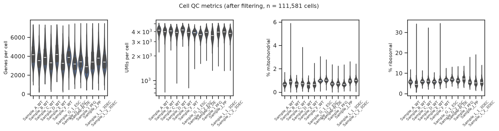

**Figure 3.** Per-sample distributions of genes per cell, UMIs per cell, mitochondrial fraction and ribosomal fraction. x-axis: sample; y-axis: the named metric (UMI panel on a log scale). White bar = median. *Source: results/diabetes/figures/qc/qc_violin_after_filtering.png*

**Interpretation.** No sample is an outlier on any axis, and there is no systematic difference between the six WT-only samples (left) and the seven perturbation samples (right). This matters specifically because the WT-only samples supply three quarters of the control population for every distance and enrichment test: had they differed in depth or complexity, every perturbation would have shown an apparent phenotype driven by batch. They do not.

### 5.2 Perturbation assignment and representation

Guide assignment is unusually clean because genotype is a clonal line identity carried in obs['genotype'], not a guide call inferred from CRISPR-capture counts: 78,888 targeting and 32,693 non-targeting cells, with 0 ambiguous and 0 unassigned (guide_qc.csv). Representation is nonetheless very uneven — MNX1 contributes 6,451 cells and KDM2B 182, a 35-fold range.

**Table 7.** The eight smallest perturbation populations, all of which anchor extreme values in one or more metrics. *Source: results/diabetes/tables/guide_assignment.csv*

| **Genotype** | **Cells** | **Target detectable in matrix** | **Testable for knockdown** |
|--------------|-----------|---------------------------------|----------------------------|
| KDM2B        | 182       | True                            | True                       |
| HHEXhet      | 328       | False                           | False                      |
| PDX1het      | 469       | False                           | False                      |
| HNF4Ahet     | 829       | False                           | False                      |
| BMPR1A       | 925       | True                            | True                       |
| GLIS3        | 935       | True                            | True                       |
| TET1/2/3     | 948       | False                           | False                      |
| HNF4A        | 987       | True                            | True                       |

*Cell count is inversely correlated with every magnitude metric: Spearman rho = -0.45 (p = 0.0062) with energy distance, -0.40 (p = 0.043) with median PS, -0.38 (p = 0.021) with mean absolute lochNESS. Small populations are also the most compositionally skewed, which is the mechanism (Section 9.3).*

Two masking rules protect against over-reading sparse combinations. Genotype x cell-state cells with fewer than 10 cells are set to NaN and rendered grey in the plotted PS and lochNESS matrices (diabetes_analysis.py:3609 and 3691), and the same 10-cell minimum gates entry into lochness_by_celltype and ps_by_genotype_celltype summaries. Of the 36 x 15 = 540 possible genotype x cell-state combinations, 505 are observed at all, 362 have at least 10 cells for lochNESS, and 271 have at least 10 cells with a valid PS value. Roughly half the matrix is therefore genuinely evaluable, and the figures make the other half visible as grey rather than hiding it.

### 5.3 Did the perturbations perturb? A caveat specific to null alleles

The generic pipeline run performs a check the bespoke workflow does not: for each genotype whose label is a gene symbol, does that gene's own transcript fall in the perturbed cells relative to WT? The answer is instructive.

**Table 8.** Direct target-transcript test for the 26 genotypes whose label maps to a gene in the expression matrix, ranked by log2 fold change. Positive log2FC means the targeted transcript is higher in the mutant line than in WT. *Source: results/diabetes/tables/perturbation.csv*

| **Genotype** | **Cells** | **log2FC (own transcript)** | **% knockdown** | **KS FDR**             | **Effective** |
|--------------|-----------|-----------------------------|-----------------|------------------------|---------------|
| GLIS3        | 935       | -1.95                       | 74.1            | 2.3200000000000002e-99 | True          |
| NEUROG3      | 1543      | -1.8                        | 71.2            | 3.84e-11               | True          |
| ARX          | 2549      | -1.16                       | 55.3            | 0.0426                 | True          |
| GATA6        | 1500      | -1.11                       | 53.7            | 1.57e-76               | True          |
| PROSER1      | 2473      | -0.843                      | 44.3            | 3.28e-17               | True          |
| NKX2-2       | 5236      | -0.738                      | 40.1            | 6.979999999999999e-42  | True          |
| HNF4A        | 987       | -0.724                      | 39.5            | 1.98e-14               | True          |
| PDX1         | 6207      | -0.688                      | 37.9            | 1.42e-62               | True          |
| HHEX         | 1214      | -0.625                      | 35.2            | 1.74e-13               | True          |
| OTUD5        | 3440      | -0.521                      | 30.3            | 5.32e-16               | True          |
| RFX6         | 3331      | -0.451                      | 26.8            | 1.7500000000000002e-26 | True          |
| GATA4        | 1612      | -0.404                      | 24.4            | 3.4e-19                | True          |
| PBX1         | 1010      | -0.365                      | 22.3            | 2.81e-15               | True          |
| TADA2B       | 1138      | -0.359                      | 22.0            | 0.163                  | False         |
| PAX6         | 3237      | -0.269                      | 17.0            | 0.0535                 | False         |
| TET1         | 1370      | 0.113                       | -8.16           | 2.32e-07               | False         |
| QSER1        | 1232      | 0.154                       | -11.3           | 0.00229                | False         |
| BMPR1A       | 925       | 0.163                       | -12.0           | 6.55e-09               | False         |
| FOXA1        | 5668      | 0.198                       | -14.7           | 2.51e-09               | False         |
| TLE3         | 3259      | 0.218                       | -16.3           | 0.00131                | False         |
| NEUROD1      | 2728      | 0.25                        | -18.9           | 0.00141                | False         |
| KDM2B        | 182       | 0.288                       | -22.1           | 0.0737                 | False         |
| FOXA2        | 4896      | 0.485                       | -39.9           | 9.96e-171              | False         |
| MNX1         | 6451      | 0.587                       | -50.3           | 9.22e-29               | False         |
| BCOR         | 1240      | 0.747                       | -67.8           | 3.73e-22               | False         |
| GSC          | 1652      | 1.79                        | -245.0          | 0.000407               | False         |

*13 of 26 pass (FDR < 0.05 and log2FC < 0). Ten further genotypes could not be tested at all (ps_score_skipped.csv / skipped.csv): GATA4het, GATA6het, HHEXe, HHEXhet, HNF4Ahet, NANOGe-het, ONECUT1e, PDX1het, QSER1TET1, TET1/2/3.*

> **Why 'only 13 of 26 effective' is not a failure**
>
> These are clonal null-allele lines — frameshifts, indels, enhancer deletions — not CRISPRi knockdowns. A frameshifted transcript that escapes nonsense-mediated decay is still present and still counted; a transcription factor that autorepresses its own locus will show its transcript go up when its protein is lost. That is what GSC (+1.79 log2FC), BCOR (+0.75), MNX1 (+0.59) and FOXA2 (+0.49) look like. The '% knockdown' column is a CRISPRi metric being applied to a genetic-knockout experiment, and should not be used as a perturbation-validity filter here. This is not a cosmetic point: PS's 'responder fraction' is defined as high PS AND low target expression, so genotypes whose transcript does not fall are systematically classified as 'escapers' rather than responders. FOXA2 has 33.8% of cells above the PS threshold but a responder fraction of 5.7% and an escaper fraction of 28.1%; NEUROD1 has 23.2% above threshold, 1.5% responders and 21.7% escapers. Report pct_high_ps, not ps_responder_fraction, for this dataset.

A useful internal control comes free with the PS stage: the same quadrant rule is applied to sampled control cells, giving a false-positive rate per genotype. The median across 26 genotypes is 8.7% of control cells misclassified as knocked down (range 0.27–14.5%), which sets a realistic floor for how small a responder fraction is meaningful.

## 6. Question 1 — did the perturbation produce a measurable response at all?

### 6.1 Why a population-level test is needed before anything else

The first question is not how large an effect is, but whether the perturbed population is distinguishable from control at all. Differential expression answers this one gene at a time and ignores covariance; a distributional test asks it once, over the whole multivariate state.

The DistanceTest computes the energy distance between the perturbed and control point clouds in 50-dimensional PCA space:

*E(P, Q) = 2·E‖X − Y‖ − E‖X − X′‖ − E‖Y − Y′‖, X, X′ ~ P; Y, Y′ ~ Q*

Energy distance is zero if and only if the two distributions are identical, and it is sensitive to differences in location, spread and shape rather than only in the mean. Significance comes from 1,000 random reassignments of the perturbed/control labels, with Benjamini–Hochberg correction across the 36 genotypes. Up to 2,000 cells per genotype and 5,000 control cells are sampled (seed 123).

### 6.2 Result

**All 36 perturbations are significant, every one of them at the permutation resolution floor (p = FDR = 1/1001 = 0.000999).** Zero genotypes were skipped for insufficient cells. This is a clean positive answer to Question 1 and it includes the ten genotypes for which no PS score could be computed — so the absence of a PS value in Section 7 reflects a gene-symbol lookup failure, not a silent perturbation.

**Table 9.** Energy distance from WT: the ten largest and six smallest of 36 genotypes. All 36 are significant at FDR = 0.000999. *Source: results/diabetes_specific/tables/distance_results.csv*

| **Genotype** | **Cells** | **Energy distance** | **MMD** | **FDR**  |
|--------------|-----------|---------------------|---------|----------|
| PDX1het      | 469       | 13.634              | 0.3129  | 9.99e-04 |
| HHEXhet      | 328       | 10.473              | 0.2307  | 9.99e-04 |
| GATA6        | 1500      | 9.704               | 0.1590  | 9.99e-04 |
| KDM2B        | 182       | 9.320               | 0.2087  | 9.99e-04 |
| HHEX         | 1214      | 8.995               | 0.2034  | 9.99e-04 |
| GLIS3        | 935       | 7.969               | 0.1854  | 9.99e-04 |
| GSC          | 1652      | 5.876               | 0.1255  | 9.99e-04 |
| QSER1TET1    | 1157      | 5.636               | 0.1262  | 9.99e-04 |
| HHEXe        | 1487      | 5.623               | 0.1227  | 9.99e-04 |
| FOXA2        | 4896      | 5.447               | 0.1063  | 9.99e-04 |
| FOXA1        | 5668      | 1.475               | 0.0317  | 9.99e-04 |
| NKX2-2       | 5236      | 1.458               | 0.0311  | 9.99e-04 |
| NEUROD1      | 2728      | 1.419               | 0.0322  | 9.99e-04 |
| BCOR         | 1240      | 1.367               | 0.0299  | 9.99e-04 |
| PAX6         | 3237      | 1.153               | 0.0263  | 9.99e-04 |
| MNX1         | 6451      | 1.075               | 0.0234  | 9.99e-04 |

*MMD (maximum mean discrepancy) is reported alongside as a secondary distributional statistic; it ranks the genotypes almost identically (it is a monotone companion, not independent evidence). Note that the three smallest cell populations in the dataset — PDX1het (n=469), HHEXhet (n=328) and KDM2B (n=182) — occupy ranks 1, 2 and 4. Section 9.3 shows why.*

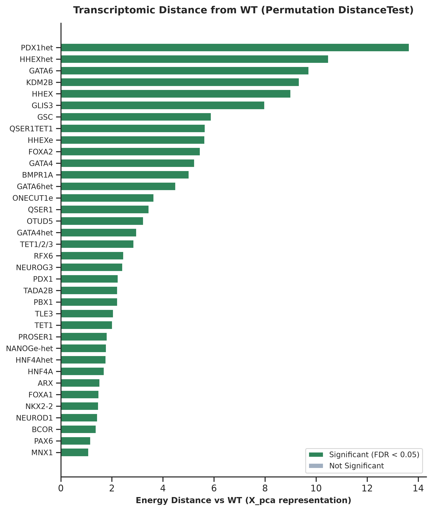

**Figure 4.** Energy distance from WT for all 36 genotypes, ranked. x-axis: energy distance in 50-PC space; y-axis: genotype. Green indicates significance at FDR < 0.05 (all bars). *Source: results/diabetes_specific/figures/06_energy_distance_by_perturbation.png*

**Interpretation.** Because every genotype clears significance, the useful information in this panel is the ordering and its 13-fold dynamic range, not the significance calls. The ranking is dominated at the top by genotypes whose cells arrest early (PDX1het, HHEXhet, KDM2B, GLIS3, HHEX — 42–87% of their cells at the ESC stage) and at the bottom by well-represented genotypes whose cells complete differentiation (MNX1, PAX6, BCOR, NEUROD1, NKX2-2, FOXA1). Read as a magnitude scale this ordering would be misleading; read as a developmental-arrest scale it is informative. The uniform FDR floor is a resolution limit of the 1,000-permutation design, not evidence that all 36 effects are equally certain — a larger permutation budget would separate them.

## 7. Question 2 — how strongly, and how uniformly, do individual cells respond?

### 7.1 What PS measures

A population-level distance cannot tell whether every cell shifted a little or a few cells shifted a lot. The perturbation score answers that. For each target, pertps 0.1.0 (the lab's Python implementation of the scMAGeCK-style score) learns a transcriptional perturbation signature by comparing that target's cells with non-targeting controls, then projects every cell onto the signature to give a score in [0, 1]: 0 means indistinguishable from control, 1 means fully displaced along the perturbation axis.

Combining PS with the targeted gene's own expression yields four classes, which the pipeline stores per cell in obs['ps_quadrant']:

-   successful knockdown — high PS, low target expression (20,949 cells)

-   escaper — high PS, high target expression (6,748 cells)

-   non-responder — low PS, high target expression (10,674 cells)

-   low signal — low PS, low target expression (27,644 cells)

45,566 cells are 'not applicable': the 32,693 WT cells plus the 12,873 cells belonging to the ten genotypes that could not be scored. 66,015 cells across 26 genotypes carry a PS value.

### 7.2 Genotype-level response strength

**Table 10.** Per-cell perturbation score summarised per genotype, all 26 scored genotypes, ranked by median PS. *Source: results/diabetes_specific/tables/ps_by_genotype.csv*

| **Genotype** | **Cells** | **Median PS** | **Mean PS** | **IQR**   | **% PS > 0.5** |
|--------------|-----------|---------------|-------------|-----------|-------------------|
| GLIS3        | 935       | 0.750         | 0.607       | 0.40–0.83 | 67.7              |
| KDM2B        | 182       | 0.681         | 0.627       | 0.46–0.83 | 73.6              |
| HHEX         | 1214      | 0.659         | 0.605       | 0.45–0.79 | 68.3              |
| GATA6        | 1500      | 0.648         | 0.578       | 0.48–0.73 | 73.1              |
| GATA4        | 1612      | 0.622         | 0.534       | 0.27–0.78 | 62.1              |
| GSC          | 1652      | 0.607         | 0.539       | 0.32–0.79 | 60.8              |
| BMPR1A       | 925       | 0.538         | 0.497       | 0.32–0.71 | 55.4              |
| QSER1        | 1232      | 0.535         | 0.474       | 0.23–0.75 | 52.8              |
| MNX1         | 6451      | 0.467         | 0.403       | 0.06–0.65 | 46.5              |
| PROSER1      | 2473      | 0.462         | 0.404       | 0.25–0.57 | 42.0              |
| HNF4A        | 987       | 0.458         | 0.421       | 0.16–0.64 | 44.9              |
| RFX6         | 3331      | 0.451         | 0.405       | 0.29–0.56 | 39.8              |
| OTUD5        | 3440      | 0.446         | 0.451       | 0.20–0.77 | 44.0              |
| NEUROG3      | 1543      | 0.440         | 0.399       | 0.27–0.56 | 36.3              |
| ARX          | 2549      | 0.440         | 0.382       | 0.18–0.56 | 38.3              |
| FOXA1        | 5668      | 0.430         | 0.402       | 0.06–0.67 | 43.2              |
| NKX2-2       | 5236      | 0.420         | 0.388       | 0.20–0.57 | 36.6              |
| TET1         | 1370      | 0.394         | 0.390       | 0.10–0.65 | 42.8              |
| PDX1         | 6207      | 0.378         | 0.378       | 0.00–0.73 | 41.3              |
| TADA2B       | 1138      | 0.366         | 0.417       | 0.24–0.58 | 30.4              |
| BCOR         | 1240      | 0.348         | 0.364       | 0.21–0.50 | 25.2              |
| FOXA2        | 4896      | 0.331         | 0.399       | 0.22–0.61 | 33.8              |
| NEUROD1      | 2728      | 0.268         | 0.339       | 0.08–0.46 | 23.2              |
| PBX1         | 1010      | 0.249         | 0.345       | 0.12–0.66 | 27.3              |
| PAX6         | 3237      | 0.168         | 0.337       | 0.03–0.67 | 30.4              |
| TLE3         | 3259      | 0.164         | 0.387       | 0.00–0.89 | 38.7              |

*Ten genotypes are absent because their label is not a gene symbol in the matrix: GATA4het, GATA6het, HHEXe, HHEXhet, HNF4Ahet, NANOGe-het, ONECUT1e, PDX1het, QSER1TET1, TET1/2/3 (ps_score_skipped.csv, reason 'target gene not in the expression matrix').*

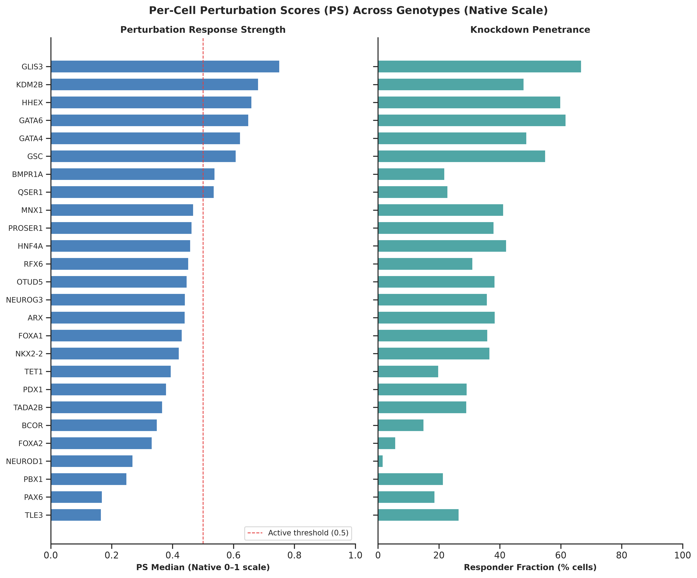

**Figure 5.** Left: median per-cell PS per genotype (native 0–1 scale; dashed line at the 0.5 activity threshold). Right: responder fraction, defined as the percentage of cells classified 'successful knockdown' (high PS AND low target-gene expression). Genotypes ordered by median PS. *Source: results/diabetes_specific/figures/05_ps_by_perturbation.png*

**Interpretation.** Eight genotypes exceed the 0.5 threshold at the median — GLIS3 (0.750), KDM2B (0.681), HHEX (0.659), GATA6 (0.648), GATA4 (0.622), GSC (0.607), BMPR1A (0.538), QSER1 (0.535) — and every one of them is an early-acting endoderm or pluripotency-exit regulator. The bottom of the ranking is occupied by TLE3 (0.164), PAX6 (0.168) and PBX1 (0.249), which are late endocrine factors. Section 8 shows that this is not a statement about how strong those perturbations are; it is a statement about which cell states each genotype's cells happen to occupy. The right-hand panel should be read with the caveat from Section 5.3: FOXA2 and NEUROD1 have near-zero responder fractions only because their own transcripts are not reduced in the mutant lines.

### 7.3 Response homogeneity is itself a phenotype

The interquartile range of PS within a genotype separates two qualitatively different response modes, and this distinction does not appear anywhere in the genotype-level summaries used by the earlier internal documents.

**Table 11.** The five most heterogeneous and five most homogeneous PS distributions. *Source: results/diabetes_specific/tables/ps_by_genotype.csv*

| **Genotype** | **Cells** | **Median PS** | **Q25** | **Q75** | **IQR** | **Mode**        |
|--------------|-----------|---------------|---------|---------|---------|-----------------|
| TLE3         | 3259      | 0.164         | 0.000   | 0.894   | 0.894   | bimodal / gated |
| PDX1         | 6207      | 0.378         | 0.000   | 0.735   | 0.735   | bimodal / gated |
| PAX6         | 3237      | 0.168         | 0.025   | 0.669   | 0.644   | bimodal / gated |
| FOXA1        | 5668      | 0.430         | 0.059   | 0.672   | 0.613   | bimodal / gated |
| MNX1         | 6451      | 0.467         | 0.056   | 0.648   | 0.592   | bimodal / gated |
| PROSER1      | 2473      | 0.462         | 0.253   | 0.574   | 0.321   | uniform         |
| NEUROG3      | 1543      | 0.440         | 0.265   | 0.557   | 0.292   | uniform         |
| BCOR         | 1240      | 0.348         | 0.213   | 0.504   | 0.291   | uniform         |
| RFX6         | 3331      | 0.451         | 0.290   | 0.561   | 0.271   | uniform         |
| GATA6        | 1500      | 0.648         | 0.477   | 0.728   | 0.251   | uniform         |

**TLE3 spans an interquartile range of 0.894 on a scale that only runs from 0 to 1** — a quarter of its cells score essentially 0 and a quarter score essentially 0.9. PDX1 (IQR 0.735) and PAX6 (IQR 0.644) behave the same way. GATA6 (IQR 0.251), RFX6 (0.271) and BCOR (0.291) do not: their cells respond as one population.

**OBSERVATION:** PS distributions within a genotype are either unimodal or strongly bimodal. **INTERPRETATION:** bimodality implies a gate — some property of a cell determines whether it can respond at all. **The next section identifies that gate.**

## 8. Question 3 — in which cellular context does the response occur?

This is the section in which the analysis stops being a ranking exercise and starts producing developmental biology. Three independent readouts are available at genotype x cell-state resolution: PS (response strength), lochNESS (state-space localisation) and the CMH enrichment test (compositional over- or under-representation). They agree with each other and with the published phenotypes of these genes.

### 8.1 The developmental gate: PS resolved by cell state

PS pooled across all genotypes is already state-dependent — highest in ESC and lowest in the PP and SC-delta compartments — but that global pattern is a mixture over genotypes and is not by itself interpretable.

**Table 12.** PS pooled across all 26 scored genotypes, by cell state. *Source: results/diabetes_specific/tables/ps_by_celltype2.csv*

| **Cell state** | **Cells with PS** | **Mean PS** | **Median PS** | **IQR**   |
|----------------|-------------------|-------------|---------------|-----------|
| ESC            | 13463             | 0.568       | 0.642         | 0.39–0.78 |
| ESC (D3)       | 110               | 0.569       | 0.653         | 0.45–0.77 |
| DE             | 11528             | 0.450       | 0.485         | 0.29–0.63 |
| PFG            | 10907             | 0.349       | 0.366         | 0.16–0.52 |
| PGT            | 134               | 0.370       | 0.402         | 0.20–0.53 |
| PP             | 5331              | 0.134       | 0.065         | 0.00–0.23 |
| PDP            | 5633              | 0.353       | 0.357         | 0.20–0.50 |
| EnP            | 1116              | 0.228       | 0.022         | 0.00–0.45 |
| SC-EC          | 5377              | 0.460       | 0.487         | 0.00–0.87 |
| SC-alpha       | 2879              | 0.371       | 0.226         | 0.00–0.75 |
| SC-beta        | 1928              | 0.402       | 0.107         | 0.00–0.91 |
| SC-delta       | 369               | 0.180       | 0.000         | 0.00–0.14 |
| Liver          | 2726              | 0.549       | 0.607         | 0.41–0.75 |
| Stromal        | 3474              | 0.389       | 0.372         | 0.20–0.56 |
| Endothelial    | 1040              | 0.311       | 0.302         | 0.05–0.53 |

*A per-state baseline of this kind is a prerequisite for comparing genotypes: a genotype whose cells sit mostly in ESC starts from a pooled mean of 0.568, one whose cells sit mostly in PP starts from 0.134.*

The informative object is the full genotype x cell-state matrix.

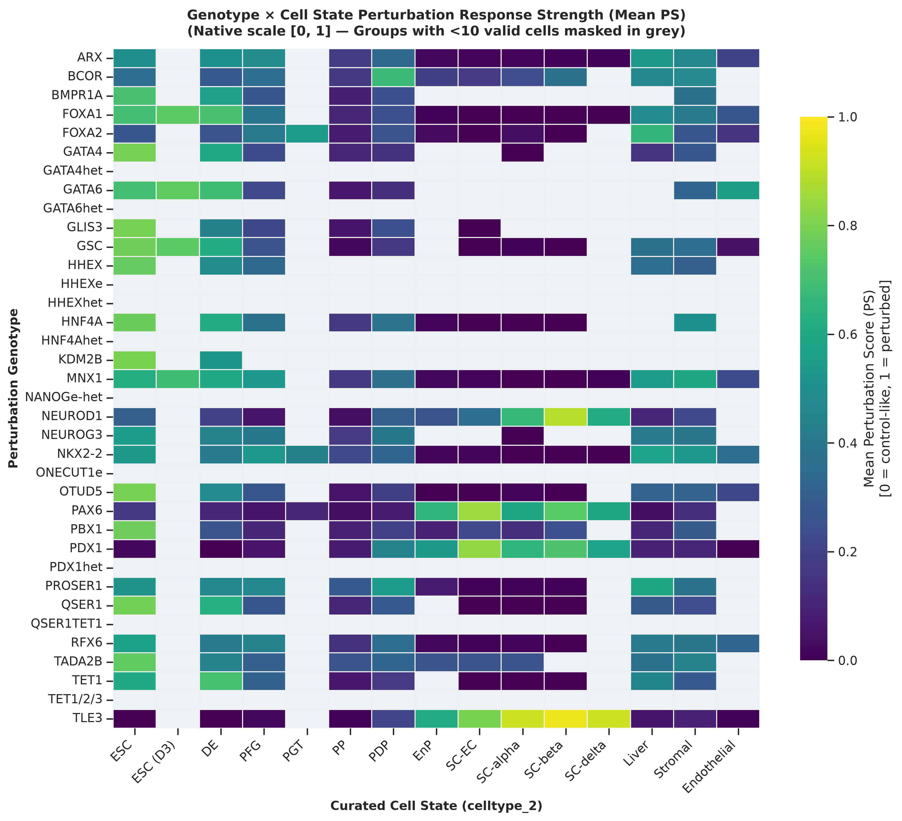

**Figure 6.** Mean PS for every genotype x cell-state combination with at least 10 cells carrying a valid PS value (271 of 505 observed combinations). Rows: genotype (alphabetical); columns: cell state in differentiation order. Colour: mean PS, 0 (dark) to 1 (yellow), native scale. Grey = fewer than 10 scored cells, or a genotype with no PS at all (the ten het/enhancer/compound lines appear as fully grey rows). *Source: results/diabetes_specific/figures/24_ps_genotype_celltype_heatmap.png*

**Interpretation.** This is the central result of the programme. The matrix has an unmistakable two-block structure. An upper/early block — GATA6, GATA4, GSC, HHEX, GLIS3, KDM2B, QSER1, MNX1, FOXA1, HNF4A, TET1, OTUD5, RFX6, NKX2-2, BMPR1A — scores high in ESC, ESC (D3) and DE and falls to near zero across the endocrine columns (EnP, SC-EC, SC-alpha, SC-beta, SC-delta). A lower/late block — PDX1, PAX6, TLE3, NEUROD1, and to a lesser extent PBX1 — does the exact reverse: near-zero PS in ESC, DE, PFG and PP, and the highest values in the whole matrix in the endocrine columns. FOXA2 is a third pattern: its single hot cell state is Liver, the fate it diverts into. The bimodality of Section 7.3 is therefore not noise and not incomplete penetrance — it is a developmental gate. A cell responds to loss of TLE3 only once it has become an endocrine cell, because that is the first point at which TLE3 has a job to do.

**Table 13.** Response strength collapses or expands by an order of magnitude depending on which cell state it is measured in. 'Progenitors' = median over ESC, DE, PFG, PP; 'endocrine' = median over SC-EC, SC-alpha, SC-beta, SC-delta, EnP (states with >=10 scored cells only). *Source: results/diabetes_specific/tables/ps_by_genotype_celltype.csv*

| **Genotype** | **Global median PS** | **Peak state** | **Peak median PS** | **Peak n** | **Median PS, progenitors** | **Median PS, endocrine** |
|--------------|----------------------|----------------|--------------------|------------|----------------------------|--------------------------|
| PDX1         | 0.378                | SC-EC          | 0.852              | 1576       | 0.000                      | 0.665                    |
| PAX6         | 0.168                | SC-EC          | 0.932              | 828        | 0.066                      | 0.697                    |
| TLE3         | 0.164                | SC-beta        | 1.000              | 248        | 0.000                      | 0.960                    |
| NEUROD1      | 0.268                | SC-beta        | 0.936              | 464        | 0.120                      | 0.627                    |
| GATA6        | 0.648                | ESC (D3)       | 0.730              | 14         | 0.454                      | —                        |
| FOXA2        | 0.331                | Liver          | 0.703              | 1667       | 0.265                      | 0.000                    |
| GLIS3        | 0.750                | ESC            | 0.803              | 603        | 0.330                      | 0.000                    |
| RFX6         | 0.451                | ESC            | 0.581              | 776        | 0.441                      | 0.000                    |

> **The clearest single fact in this dataset**
>
> TLE3 ranks last of 26 genotypes on genotype-level median PS (0.164) and 24th of 36 on energy distance from WT (2.044). Resolved by cell state, TLE3 has a median PS of 1.000 in SC-beta (n = 248), 0.993 in SC-alpha (n = 584), 0.960 in SC-delta (n = 36) and 0.848 in SC-EC (n = 372), against 0.000 in ESC, DE, PFG and PP. PAX6 behaves the same way: last-but-one on the global ranking, 0.932 in SC-EC (n = 828). Any screen that ranks perturbations by a single pooled statistic will rank both of these genes as non-hits, and both are established, published beta-cell regulators. This is the concrete argument for state-resolved phenotyping.

### 8.2 lochNESS: where perturbed cells accumulate

lochNESS asks a different question from PS. For each cell and each perturbation g:

*lochNESS(cell, g) = local_fraction(g) / overall_fraction(g) − 1*

where local_fraction is the share of that cell's k nearest neighbours carrying g and overall_fraction is g's share of the whole dataset. Zero means the perturbation is as common in the neighbourhood as chance predicts; positive means locally over-represented; negative means under-represented. The graph here uses k = 300 neighbours in 50-PC space (the run log records a median of 301 neighbours per cell). This is the same score pertTF was trained to predict, computed directly on the observed data.

> **Two implementation facts that change how these numbers should be read**
>
> (1) The summaries in this project are SELF-scores: obs['lochness_self'] holds, for each cell, the lochNESS value for the perturbation that cell actually carries, and every 'lochNESS by genotype' or 'by cell state' table aggregates that column. A genotype-level mean lochNESS therefore measures how tightly that genotype's own cells cluster together relative to its global abundance — self-aggregation — not enrichment against WT. This is why positive fractions are uniformly high (mean 0.892 across genotypes, minimum 0.787) and why the genotype x cell-state heatmap is almost entirely red.
>
> (2) The score is bounded below at -1 (a cell with no same-genotype neighbours) and unbounded above. Observed negative means fall in a narrow band from -0.24 to -0.47, i.e. compressed against the floor, while positive means reach +15.0. A scalar 'negative lochNESS' therefore cannot express the magnitude of depletion, and the finding that it correlates with nothing (Section 10) is at least partly a floor artefact rather than a biological independence result. Depletion is better measured by the enrichment test of Section 8.3.

**Table 14.** Genotype-level self-lochNESS, the fourteen most locally aggregated genotypes. *Source: results/diabetes_specific/tables/lochness_by_genotype.csv*

| **Genotype** | **Cells** | **Mean lochNESS** | **Median** | **Mean positive** | **Mean negative** | **Positive frac** |
|--------------|-----------|-------------------|------------|-------------------|-------------------|-------------------|
| PDX1het      | 469       | 13.73             | 14.02      | 14.45             | -0.21             | 0.95              |
| GATA6        | 1500      | 13.72             | 4.31       | 15.04             | -0.38             | 0.91              |
| TADA2B       | 1138      | 11.18             | 7.14       | 12.21             | -0.31             | 0.92              |
| GLIS3        | 935       | 9.34              | 4.55       | 10.40             | -0.39             | 0.90              |
| KDM2B        | 182       | 6.91              | 5.11       | 6.91              | —                 | 1.00              |
| FOXA2        | 4896      | 6.07              | 3.24       | 7.38              | -0.41             | 0.83              |
| PDX1         | 6207      | 5.91              | 3.90       | 7.24              | -0.47             | 0.83              |
| TET1/2/3     | 948       | 5.02              | 3.30       | 5.51              | -0.38             | 0.92              |
| HHEXhet      | 328       | 4.62              | 4.65       | 4.62              | —                 | 1.00              |
| GSC          | 1652      | 4.35              | 3.26       | 5.33              | -0.42             | 0.83              |
| PBX1         | 1010      | 4.34              | 3.04       | 4.71              | -0.39             | 0.93              |
| NEUROD1      | 2728      | 4.12              | 0.90       | 4.77              | -0.27             | 0.87              |
| BMPR1A       | 925       | 3.82              | 3.01       | 4.05              | -0.37             | 0.95              |
| PROSER1      | 2473      | 3.77              | 1.25       | 4.31              | -0.33             | 0.88              |

*Mean positive values span +1.30 to +15.04; mean negative values span only -0.24 to -0.47, illustrating the asymmetry described above.*

The genotype x cell-state resolution is again where the biology is.

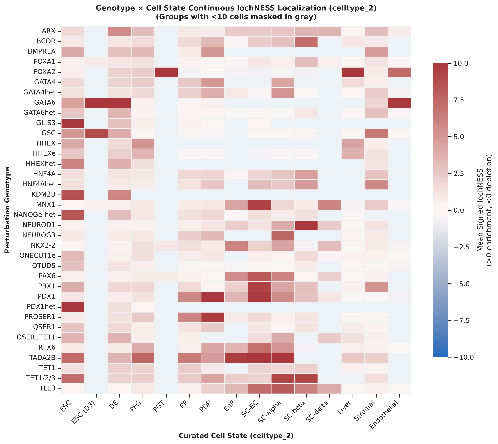

**Figure 7.** Mean signed self-lochNESS for each genotype x cell state with at least 10 cells (362 of 505 observed combinations). Rows: genotype; columns: cell state in differentiation order. Colour: mean lochNESS on a diverging scale centred at zero (red = local over-representation, blue = under-representation); grey = <10 cells. *Source: results/diabetes_specific/figures/13_lochness_by_celltype.png*

**Interpretation.** Each row is a localisation fingerprint, and the strongest entries recover the published lineage diversions exactly: GATA6 is saturated in Endothelial and DE; FOXA2 in Liver and PGT; GLIS3, PDX1het, NANOGe-het, KDM2B and HHEXhet in ESC; PDX1 in PDP and SC-EC; PAX6, PBX1, RFX6 and MNX1 in SC-EC; TADA2B and TLE3 in SC-alpha and SC-EC; NEUROD1 in SC-beta. The panel is almost entirely red because of the self-score property described above — the diverging colour scale is present but the blue half is essentially unused, and the figure should be read as a map of where each perturbation aggregates rather than as a two-sided enrichment/depletion map.

**Table 15.** The sixteen strongest genotype x cell-state localisations supported by at least 50 cells. *Source: results/diabetes_specific/tables/lochness_by_celltype.csv*

| **Genotype** | **Cell state** | **Cells** | **Mean lochNESS** | **Median** | **Positive frac** |
|--------------|----------------|-----------|-------------------|------------|-------------------|
| GATA6        | Endothelial    | 386       | 31.02             | 33.85      | 1.000             |
| TADA2B       | SC-alpha       | 181       | 29.98             | 32.55      | 1.000             |
| NEUROD1      | SC-beta        | 464       | 19.56             | 21.83      | 1.000             |
| GATA6        | DE             | 327       | 18.01             | 20.25      | 0.960             |
| TADA2B       | SC-EC          | 141       | 16.79             | 17.89      | 0.972             |
| PDX1het      | ESC            | 412       | 15.51             | 16.39      | 0.998             |
| FOXA2        | Liver          | 1667      | 13.74             | 14.67      | 0.996             |
| GLIS3        | ESC            | 603       | 13.63             | 15.26      | 0.982             |
| PDX1         | PDP            | 1133      | 11.23             | 13.33      | 0.964             |
| PDX1         | SC-EC          | 1576      | 9.79              | 10.71      | 0.994             |
| PROSER1      | PDP            | 530       | 9.65              | 10.54      | 0.962             |
| MNX1         | SC-EC          | 671       | 9.42              | 10.09      | 0.966             |
| PBX1         | SC-EC          | 222       | 9.40              | 8.91       | 0.986             |
| TET1/2/3     | SC-alpha       | 73        | 9.17              | 9.56       | 0.973             |
| KDM2B        | ESC            | 95        | 8.61              | 7.15       | 1.000             |
| NANOGe-het   | ESC            | 257       | 8.47              | 8.30       | 0.938             |

*Every one of these has a positive fraction above 0.93, i.e. essentially all of the genotype's cells in that state show local over-representation. These are not tail-driven means.*

### 8.3 Compositional enrichment and depletion

lochNESS as implemented cannot quantify depletion; the enrichment test can. For each genotype x cell state the pipeline builds a 2x2 table (in state / not in state) x (this genotype / reference) within each of the 13 samples and combines them with a Cochran–Mantel–Haenszel statistic, so a genotype cannot appear enriched merely because it was captured in a sample with a different differentiation efficiency. An omnibus permutation test on the whole 36 x 15 contingency structure gives chi-square = 51,915 on 490 degrees of freedom, permutation p = 0.000999.

Two reference choices are computed and both are written to celltype_enrichment.csv:

-   Against all other perturbed cells ('other'): 313 of 540 pairs significant at FDR < 0.05 — 118 enriched and 195 depleted. This is the comparison the bespoke workflow flags as significant.

-   Against WT ('ntc'): 309 of 540 significant in the generic pipeline run, which sets primary_control: ntc. The bespoke run computes the same p-values but leaves the significant flag False for these rows, because significance is defined as FDR < alpha AND control == primary_control (enrichment.py:1910).

> **Which reference to use, and a real artefact in the WT-referenced version**
>
> The WT-referenced comparison is more intuitive but is distorted by cell states that WT does not occupy. Its top 23 hits by odds ratio are almost all 'ESC (D3)', a state with 131 cells in the entire dataset and zero cells in the WT reference (pct_of_reference = 0.000), giving odds ratios of 240–740 from as few as 2–4 cells. Those rows are formally significant and biologically empty. The 'other'-referenced comparison does not have this failure mode and is what Table 16 reports. Its limitation is different and must be stated: because the reference is the pooled set of all other perturbed cells, an effect shared by many perturbations (for example, generic failure to reach SC-beta) will be partly cancelled out. The two references answer different questions — 'different from normal development' versus 'different from other mutants' — and a stage-matched WT reference (Section 17) would answer the first one properly.

**Table 16.** Strongest cell-state enrichments, reference = all other perturbed cells, CMH stratified by sample. *Source: results/diabetes_specific/tables/celltype_enrichment.csv*

| **Genotype** | **Cell state** | **Cells in state** | **% of genotype** | **% of reference** | **log2 OR** | **FDR** |
|--------------|----------------|--------------------|-------------------|--------------------|-------------|---------|
| GATA6        | Endothelial    | 386                | 25.73             | 0.95               | +6.31       | 0.0e+00 |
| FOXA2        | Liver          | 1667               | 34.05             | 1.82               | +4.28       | 0.0e+00 |
| KDM2B        | SC-delta       | 1                  | 0.55              | 0.51               | +3.91       | 2.9e-03 |
| GSC          | Stromal        | 375                | 22.70             | 4.87               | +3.69       | 0.0e+00 |
| BMPR1A       | PDP            | 195                | 21.08             | 8.20               | +3.54       | 0.0e+00 |
| PDX1het      | SC-EC          | 6                  | 1.28              | 7.30               | +3.19       | 2.3e-03 |
| NEUROD1      | SC-beta        | 464                | 17.01             | 2.36               | +2.83       | 0.0e+00 |
| MNX1         | SC-delta       | 168                | 2.60              | 0.33               | +2.74       | 0.0e+00 |
| GATA4        | PDP            | 232                | 14.39             | 8.23               | +2.58       | 0.0e+00 |
| KDM2B        | SC-beta        | 2                  | 1.10              | 2.87               | +2.56       | 4.7e-02 |
| GSC          | ESC            | 706                | 42.74             | 22.31              | +2.50       | 0.0e+00 |
| PAX6         | SC-EC          | 828                | 25.58             | 6.48               | +2.43       | 0.0e+00 |
| TADA2B       | PGT            | 8                  | 0.70              | 0.19               | +2.38       | 2.3e-06 |
| TADA2B       | DE             | 172                | 15.11             | 18.32              | +2.30       | 0.0e+00 |
| TADA2B       | SC-alpha       | 181                | 15.91             | 3.92               | +2.29       | 0.0e+00 |
| KDM2B        | Liver          | 8                  | 4.40              | 3.82               | +2.24       | 1.9e-04 |

**Table 17.** Strongest cell-state depletions, same test. These are the developmental blocks. *Source: results/diabetes_specific/tables/celltype_enrichment.csv*

| **Genotype** | **Cell state** | **Cells in state** | **% of genotype** | **% of reference** | **log2 OR** | **FDR** |
|--------------|----------------|--------------------|-------------------|--------------------|-------------|---------|
| NEUROG3      | SC-beta        | 0                  | 0.00              | 2.92               | -6.54       | 6.7e-14 |
| BMPR1A       | SC-beta        | 0                  | 0.00              | 2.90               | -5.79       | 2.3e-06 |
| BMPR1A       | SC-EC          | 2                  | 0.22              | 7.35               | -5.19       | 1.9e-15 |
| NEUROG3      | SC-EC          | 5                  | 0.32              | 7.40               | -5.14       | 0.0e+00 |
| PROSER1      | SC-delta       | 1                  | 0.04              | 0.53               | -4.45       | 2.8e-05 |
| GATA6        | SC-EC          | 2                  | 0.13              | 7.40               | -4.27       | 1.4e-08 |
| GATA4        | SC-EC          | 5                  | 0.31              | 7.41               | -4.15       | 0.0e+00 |
| GATA6        | SC-alpha       | 1                  | 0.07              | 4.17               | -4.14       | 2.5e-04 |
| GATA4        | SC-delta       | 0                  | 0.00              | 0.52               | -4.09       | 3.8e-02 |
| GATA4        | SC-beta        | 2                  | 0.12              | 2.92               | -4.01       | 4.7e-07 |
| MNX1         | SC-beta        | 19                 | 0.29              | 3.09               | -3.91       | 0.0e+00 |
| HNF4Ahet     | Liver          | 2                  | 0.24              | 3.86               | -3.82       | 5.8e-06 |
| NEUROD1      | Endothelial    | 3                  | 0.11              | 1.47               | -3.55       | 3.3e-07 |
| HHEX         | PP             | 2                  | 0.16              | 7.81               | -3.51       | 2.3e-08 |

*NEUROG3 and BMPR1A produce zero SC-beta cells out of 1,543 and 925 respectively, against a reference rate of ~2.9%. GATA4 produces 2 of 1,612. These are the quantitative form of a hard developmental block.*

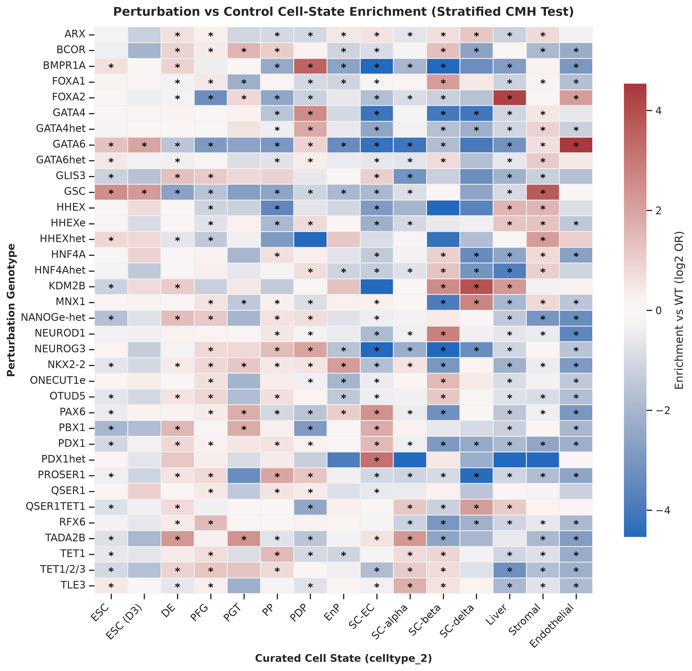

**Figure 8.** Genotype x cell-state enrichment, log2 odds ratio from the sample-stratified CMH test. Rows: genotype; columns: cell state in differentiation order. Red = enriched, blue = depleted, colour limits set to the 98th percentile of \|log2 OR\| (capped at 5). Asterisk = FDR < 0.05. *Source: results/diabetes_specific/figures/04_genotype_celltype_enrichment.png*

**Interpretation.** The complement of the lochNESS panel: this one is genuinely two-sided, and the blue is as informative as the red. Reading down the SC-beta and SC-EC columns gives the endocrine-competence phenotype of each line at a glance — BMPR1A, GATA4, GATA6, NEUROG3, HHEX and MNX1 are deep blue in SC-beta, while NEUROD1, FOXA1, TLE3 and KDM2B are red there. GATA6 x Endothelial and FOXA2 x Liver are the two strongest enrichments in the matrix. Note one labelling error to fix before reuse: the colour-bar reads 'Enrichment vs WT (log2 OR)', but the matrix plotted is the primary-control matrix, and the primary control in this run is 'other', not WT (enrichment.py:2250 uses results.primary_control; diabetes_analysis.py:1541 hard-codes the label).

### 8.4 Stage-level summary

**Table 18.** PS and self-lochNESS aggregated by derived differentiation stage. *Source: ps_by_development_stage.csv; lochness_by_development_stage.csv*

| **Stage** | **Cells with PS** | **Mean PS** | **Median PS** | **Cells with lochNESS** | **Mean lochNESS** |
|-----------|-------------------|-------------|---------------|-------------------------|-------------------|
| WT        | 0                 | —           | —             | 0                       | —                 |
| ESC       | 11061             | 0.573       | 0.650         | 15006                   | 3.12              |
| DE        | 13614             | 0.467       | 0.505         | 17029                   | 2.13              |
| PFG       | 14396             | 0.419       | 0.438         | 16374                   | 3.28              |
| PP        | 8008              | 0.153       | 0.073         | 9220                    | 2.33              |
| 3DEC      | 18936             | 0.387       | 0.337         | 21259                   | 5.32              |

*The WT row has no PS or lochNESS because both scores are defined only for perturbed cells. PS declines monotonically from ESC (0.573) through DE (0.467) and PFG (0.419) to PP (0.153) before rising again at 3DEC (0.387); lochNESS is lowest at DE (2.13) and highest at 3DEC (5.32). The PP trough and the 3DEC rise reflect the two response blocks of Section 8.1 being sampled at different stages, not a change in the sensitivity of the assay.*

## 9. Question 4 — how far has the cellular state moved?

### 9.1 What energy distance measures here, and what it does not

Section 6 used the energy distance as a detector. Used as a magnitude, it is the size of the displacement of the whole perturbed distribution from the WT distribution in 50-PC space. Because it is a distributional statistic, it responds to three things at once: a shift in the mean state of cells that remain in the same compartments, a change in how cells are distributed across compartments, and a change in spread. In a differentiation experiment the second of these dominates, and the data confirm it.

### 9.2 The magnitude landscape

The 36 genotypes span 1.075 (MNX1) to 13.634 (PDX1het), median 2.644, with the upper quartile beginning at 5.49. The distribution is strongly right-skewed: six genotypes account for the top decile.

### 9.3 Energy distance is a composition statistic in this design

**This is the most consequential methodological finding of the audit.** Across the 36 genotypes, energy distance from WT correlates with the fraction of that genotype's cells sitting in its single most common cell state at

*Spearman ρ = +0.884, p = 9.5e-13, n = 36*

and with the fraction of its cells captured at the ESC differentiation stage at Spearman ρ = +0.808, p = 2.5e-09, n = 36.

A correlation of 0.88 leaves very little room for anything else. Mechanically, the reason is the sample design of Section 3.2: the WT reference is a compositional mixture spanning all stages, so a genotype whose cells are concentrated in one compartment is automatically far from it, whatever is happening transcriptionally within that compartment. The three smallest and most ESC-skewed populations — PDX1het (87.4% ESC-stage, n = 469), HHEXhet (42.1%, n = 328) and KDM2B (51.6%, n = 182) — are ranked 1, 2 and 4 by energy distance.

**OBSERVATION:** energy distance from WT is almost entirely explained by cell-state composition. **INTERPRETATION:** in a differentiation screen this is a legitimate and interesting readout — developmental arrest and lineage diversion are the phenotypes of interest, and both are compositional. But the quantity should be named for what it measures. Calling it 'global phenotype magnitude' (as the current figure axes do) invites the reader to interpret it as transcriptional severity, which it is not.

A specific claim in the repository's earlier internal documents should be revised on this basis. Case_Study_Evidence_Audit.md reports PDX1het's energy distance of 13.63 versus PDX1's 2.23 as evidence of 'pronounced dosage-dependent phenotypic divergence' and 'extreme dosage sensitivity'. The pairwise DistanceSpace distance between the two is 14.147, the largest het-versus-homozygote gap in the dataset — but PDX1het's cells are 87.4% ESC-stage while PDX1's are 57.5% 3DEC-stage. The two lines were, in effect, sampled at different points in development. The dosage interpretation is not supported by the current data; a stage-matched comparison would be needed to test it.

**Table 19.** Allelic series: how far apart are related genotypes in the pairwise perturbation distance space? *Source: distance_space_matrix.csv; distance_results.csv*

| **Allelic pair**   | **Pairwise energy distance** | **ED vs WT (first)** | **ED vs WT (second)** | **n (first / second)** |
|--------------------|------------------------------|----------------------|-----------------------|------------------------|
| PDX1 / PDX1het     | 14.147                       | 2.230                | 13.634                | 6207 / 469             |
| GATA6 / GATA6het   | 4.896                        | 9.704                | 4.483                 | 1500 / 2266            |
| TET1 / TET1(1/2/3) | 1.713                        | 2.004                | 2.842                 | 1370 / 948             |
| HHEX / HHEXhet     | 1.045                        | 8.995                | 10.473                | 1214 / 328             |
| HHEX / HHEXe       | 0.954                        | 8.995                | 5.623                 | 1214 / 1487            |
| QSER1 / QSER1TET1  | 0.764                        | 3.433                | 5.636                 | 1232 / 1157            |
| GATA4 / GATA4het   | 0.694                        | 5.224                | 2.950                 | 1612 / 1957            |
| HNF4A / HNF4Ahet   | 0.091                        | 1.679                | 1.754                 | 987 / 829              |

*HNF4A and HNF4Ahet are separated by 0.091, the smallest distance in the entire 630-pair matrix, and are each other's mutual nearest neighbour — an internal positive control showing that the distance space recovers a known biological relationship it was not told about. PDX1/PDX1het at 14.147 is the extreme opposite and, per the paragraph above, is confounded by stage.*

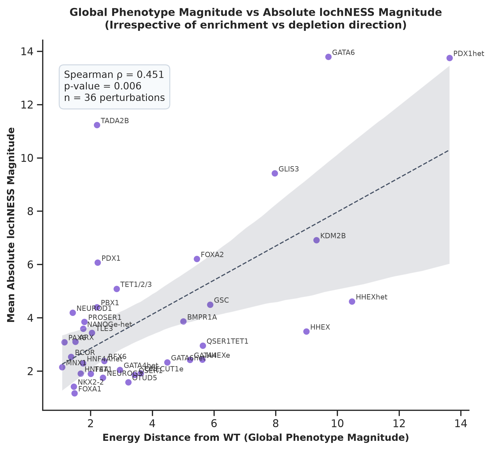

**Figure 9.** Mean absolute self-lochNESS (y) against energy distance from WT (x) for all 36 genotypes. Each point is one genotype; dashed line and grey band are the linear fit and its 95% interval. Spearman statistics annotated. *Source: results/diabetes_specific/figures/12_distance_vs_lochness_absolute.png*

**Interpretation.** The two population-level metrics are only moderately related (rho = 0.451, p = 0.006), and the informative points are the ones off the line. TADA2B and PDX1 sit high and left: modest global displacement but very strong local aggregation, which is the signature of a perturbation that moves a defined subpopulation a long way rather than moving everything a little. HHEX and HHEXhet sit low and right: large displacement from WT with comparatively little self-aggregation, consistent with a diffuse arrest rather than a discrete alternative fate. GATA6 and PDX1het are extreme on both axes.

### 9.4 The pairwise phenotype space

DistanceSpace computes all 36 x 35 / 2 = 630 pairwise energy distances between perturbed populations (not against WT), embeds them by principal coordinate analysis into 10 dimensions, records each genotype's 10 nearest phenotypic neighbours, and cuts an average-linkage tree into phenotype groups. The run produced 9 groups.

**Table 20.** Phenotype groups from average-linkage clustering of the 36 x 36 pairwise energy-distance matrix. *Source: results/diabetes_specific/tables/phenotype_groups.csv*

| **Group** | **n** | **Members**                                                                                   |
|-----------|-------|-----------------------------------------------------------------------------------------------|
| PG1       | 3     | HHEX, HHEXhet, KDM2B                                                                          |
| PG2       | 2     | GLIS3, PDX1het                                                                                |
| PG3       | 12    | ARX, FOXA1, HNF4A, HNF4Ahet, MNX1, NANOGe-het, NEUROG3, NKX2-2, PROSER1, RFX6, TET1, TET1/2/3 |
| PG4       | 10    | BMPR1A, GATA4, GATA4het, GATA6het, GSC, HHEXe, ONECUT1e, OTUD5, QSER1, QSER1TET1              |
| PG5       | 3     | BCOR, NEUROD1, TLE3                                                                           |
| PG6       | 3     | PAX6, PBX1, TADA2B                                                                            |
| PG7       | 1     | PDX1                                                                                          |
| PG8       | 1     | FOXA2                                                                                         |
| PG9       | 1     | GATA6                                                                                         |

*PG7 (PDX1), PG8 (FOXA2) and PG9 (GATA6) are singletons — the three most phenotypically distinctive perturbations in the screen, and exactly the three whose precursor phenotypes are the most distinctive (SC-EC diversion, hepatic diversion, endothelial transdifferentiation). PG3 (12 members) and PG4 (10 members) are the large, less differentiated bulk.*

**Table 21.** Nearest phenotypic neighbour for a selection of genotypes, from the 630-pair distance matrix. *Source: results/diabetes_specific/tables/distance_space_neighbors.csv*

| **Genotype** | **Nearest phenotypic neighbour** | **Energy distance** |
|--------------|----------------------------------|---------------------|
| HNF4A        | HNF4Ahet                         | 0.091               |
| HNF4Ahet     | HNF4A                            | 0.091               |
| ONECUT1e     | OTUD5                            | 0.266               |
| OTUD5        | ONECUT1e                         | 0.266               |
| GATA6het     | GATA4                            | 0.373               |
| GATA4        | GATA6het                         | 0.373               |
| FOXA1        | HNF4A                            | 0.390               |
| BCOR         | NEUROD1                          | 0.560               |
| NEUROD1      | BCOR                             | 0.560               |
| HHEX         | KDM2B                            | 0.572               |
| KDM2B        | HHEX                             | 0.572               |
| MNX1         | FOXA1                            | 0.579               |
| RFX6         | TET1                             | 0.585               |
| NKX2-2       | RFX6                             | 0.627               |
| PBX1         | PAX6                             | 0.882               |
| PAX6         | PBX1                             | 0.882               |
| GLIS3        | PDX1het                          | 1.140               |
| PDX1het      | GLIS3                            | 1.140               |
| TLE3         | NEUROD1                          | 1.158               |
| PDX1         | PAX6                             | 1.512               |

*Several pairs are mutual nearest neighbours and are recognisable as functional relationships the algorithm was not given: HNF4A/HNF4Ahet (allelic), ONECUT1e/OTUD5, PAX6/PBX1 (the SC-EC-directing pair), BCOR/NEUROD1, HHEX/KDM2B, GATA4/GATA6het. PDX1's nearest neighbour is PAX6 (1.512) and TLE3's is NEUROD1 (1.158), grouping the late endocrine regulators together.*

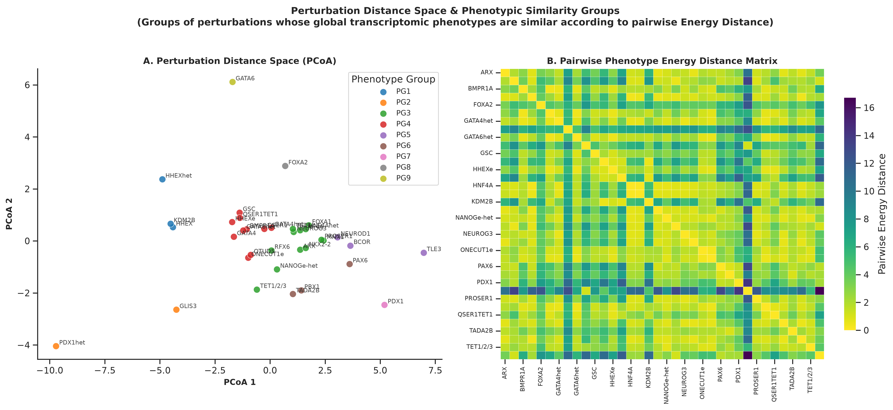

**Figure 10.** A: the 36 genotypes embedded by principal coordinate analysis of the pairwise energy-distance matrix, coloured by phenotype group; axes are PCoA 1 and 2 in energy-distance units. B: the full 36 x 36 pairwise energy-distance matrix (yellow = similar, dark = dissimilar); every second label is shown. *Source: results/diabetes_specific/figures/14_distance_space.png*

**Interpretation.** Panel A separates the distinctive phenotypes to the periphery — PDX1het and GLIS3 to the lower left, HHEXhet and KDM2B/HHEX to the left, GATA6 to the top, FOXA2 above centre, TLE3 to the right, PDX1 to the lower right — while the majority of perturbations form an undifferentiated central cloud. That central cloud is the honest result for most of these genes at this resolution: their populations are not distinguishable from one another by whole-distribution distance, even though Section 8 shows they differ sharply in which cell states they affect. This is an argument for computing the distance space per cell state rather than pooled, which is proposed in Section 17.

## 10. Do the metrics measure different things? A direct test

A framework that layers several perturbation metrics is only worth the compute if the metrics are not substitutes for one another. The programme tested this explicitly by correlating the genotype-level summaries. The results below are recomputed from the current perturbation_summary.csv and reproduce the values in the repository's Quantitative_Claim_Audit.md exactly; the partial correlations in the lower block are new to this audit.

**Table 22.** Pairwise relationships between the three genotype-level metrics. *Source: recomputed from results/diabetes_specific/tables/perturbation_summary.csv*

| **Comparison**                           | **n** | **Spearman ρ** | **p (Spearman)** | **Pearson r** | **p (Pearson)** | **Verdict** |
|------------------------------------------|-------|----------------|------------------|---------------|-----------------|-------------|
| PS (median) vs energy distance           | 26    | +0.641         | 0.000418         | +0.763        | 5.87e-06        | coupled     |
| PS vs positive lochNESS                  | 26    | +0.061         | 0.766            | +0.256        | 0.206           | independent |
| PS vs negative lochNESS                  | 25    | -0.172         | 0.412            | -0.197        | 0.344           | independent |
| PS vs \|lochNESS\|                       | 26    | +0.121         | 0.555            | +0.288        | 0.154           | independent |
| Energy distance vs positive lochNESS     | 36    | +0.410         | 0.0129           | +0.597        | 0.000122        | weak        |
| Energy distance vs negative lochNESS     | 34    | -0.141         | 0.426            | +0.081        | 0.647           | independent |
| Energy distance vs \|lochNESS\|          | 36    | +0.451         | 0.00574          | +0.626        | 4.42e-05        | coupled     |
| PS responder fraction vs energy distance | 26    | +0.469         | 0.0157           | +0.615        | 0.000827        | weak        |

### 10.1 What the marginal correlations say

-   PS and lochNESS are independent (rho = +0.061, p = 0.77 for the positive component; +0.121, p = 0.55 for the absolute component). How strongly a genotype's cells respond tells you nothing about where those cells sit. This is a real and useful result, and it is the strongest single argument in the programme for measuring both.

-   Energy distance and \|lochNESS\| are moderately coupled (rho = +0.451, p = 0.0057) — expected, since a perturbation that concentrates its cells in an unusual compartment is both far from WT and locally aggregated.

-   PS and energy distance appear strongly coupled (rho = +0.641, p = 4.2e-4; Pearson r = +0.763, p = 5.9e-6).

### 10.2 The PS–distance coupling is largely compositional

Section 8.1 showed that PS depends on cell state, and Section 9.3 showed that energy distance is essentially a measure of cell-state composition. Both therefore load on the same latent variable — where in development a genotype's cells are — and their marginal correlation should be tested against it. Conditioning on the fraction of a genotype's cells at the ESC stage (partial Spearman, rank residuals):

**Table 23.** Marginal versus partial rank correlations. Conditioning is on a single compositional covariate. *Source: recomputed from perturbation_summary.csv and diabetes_analysis.h5ad (obs)*

| **Comparison**                  | **n** | **Marginal ρ (p)** | **Partial ρ \| ESC-stage fraction (p)** | **Partial ρ \| dominant-state fraction (p)** |
|---------------------------------|-------|--------------------|-----------------------------------------|----------------------------------------------|
| PS vs energy distance           | 26    | +0.641 (0.00042)   | +0.369 (0.063)                          | +0.243 (0.23)                                |
| Energy distance vs \|lochNESS\| | 36    | +0.451 (0.0057)    | +0.333 (0.047)                          | +0.289 (0.087)                               |
| PS vs \|lochNESS\|              | 26    | +0.121 (0.55)      | -0.085 (0.68)                           | -0.131 (0.52)                                |

> **Correction to a headline claim**
>
> WIP_scientific_reading.md and Master_Scientific_Story.md conclude that 'PS and Energy Distance are strongly coupled' and use that as one leg of a three-axis coordinate system. The marginal statistic is correct, but the coupling does not survive conditioning on cell-state composition: partial rho falls to +0.369 (p = 0.063) controlling for the ESC-stage fraction and to +0.243 (p = 0.232) controlling for the dominant-state fraction. The defensible statement is: PS and energy distance are not independent, but their shared variance is substantially attributable to where each genotype's cells sit in development rather than to a direct relationship between per-cell response strength and population displacement. The PS-lochNESS independence result is unaffected, because it was null to begin with.

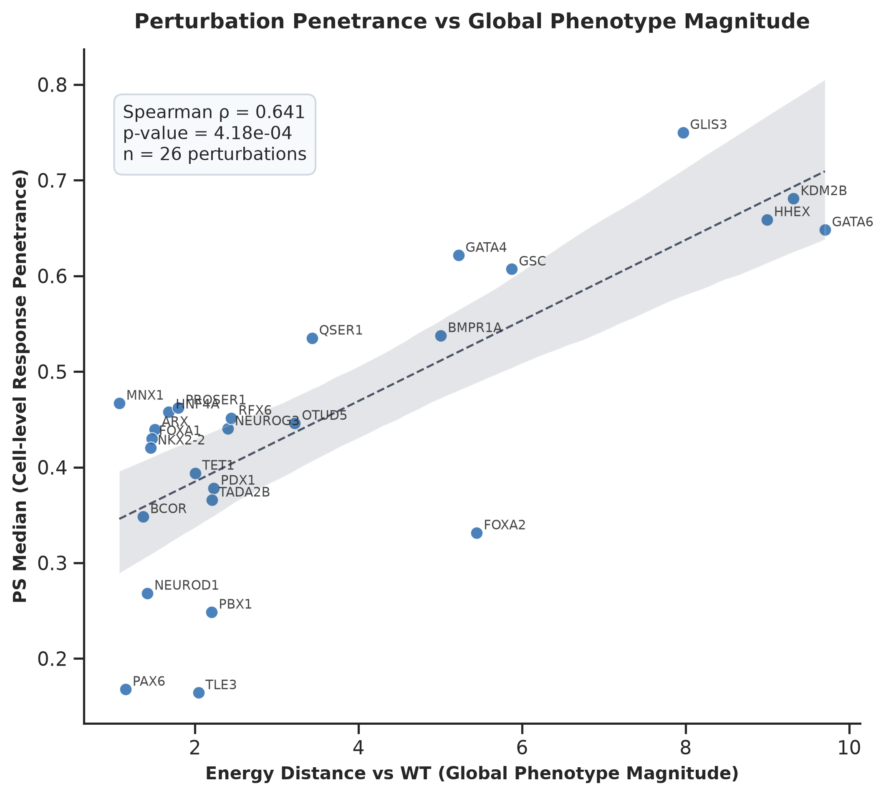

**Figure 11.** Median per-cell PS (y) against energy distance from WT (x), one point per scored genotype (n = 26). Dashed line and band: linear fit with 95% interval. Spearman statistics annotated. *Source: results/diabetes_specific/figures/07_ps_vs_distance.png*

**Interpretation.** The fit is driven by a diagonal of early-acting endoderm regulators — GLIS3, KDM2B, HHEX, GATA6, GATA4, GSC — that are simultaneously high-PS and far from WT, and by a cluster of low-PS, low-distance genotypes at the lower left. Section 10.2 shows that both blocks are defined by cell-state composition. The residuals are the interesting cases. FOXA2 (distance 5.45, median PS 0.331) has moved a long way with a modest per-cell score because its displacement is a compositional diversion into Liver rather than a uniform transcriptional shift. PAX6 (1.15, 0.168), TLE3 (2.04, 0.164) and NEUROD1 (1.42, 0.268) sit at the bottom on both axes and are, on the state-resolved analysis of Section 8.1, among the most completely penetrant perturbations in the screen within the cell states where they act.

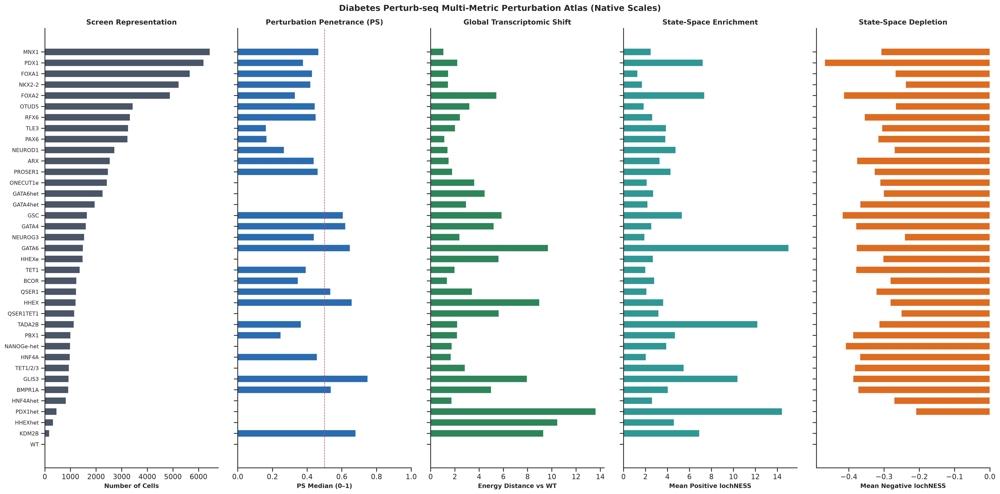

**Figure 12.** Multi-metric perturbation atlas, all 36 genotypes ordered by cell count. Panels left to right: number of cells; median PS (dashed line = 0.5 activity threshold; blank for the ten unscored genotypes); energy distance from WT; mean positive self-lochNESS; mean negative self-lochNESS. Each panel is on its own native scale. *Source: results/diabetes_specific/figures/19_perturbation_summary.png*

**Interpretation.** The value of this panel is that the five columns clearly do not rank the genotypes the same way. GATA6 is near the top on PS, distance and positive lochNESS; TADA2B is near the bottom on distance and mid-range on PS but third-highest on positive lochNESS; PDX1 is mid-range on everything except positive lochNESS. The fifth panel is the least informative and illustrates the floor effect of Section 8.2 directly: every non-missing bar lies between -0.21 and -0.47 (and two genotypes have no negatively-scored cells at all), so 'mean negative lochNESS' carries essentially no genotype-discriminating information and should be dropped from future versions of this figure in favour of a depletion statistic from the enrichment test.

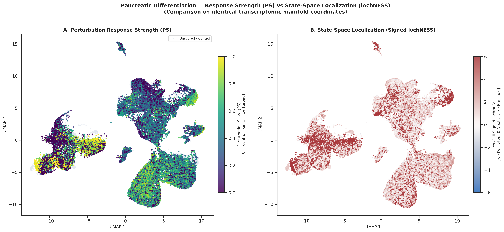

**Figure 13.** The same 50,000-cell UMAP subsample coloured by per-cell PS (A, viridis 0–1; WT and unscored cells in pale grey) and by per-cell signed self-lochNESS (B, diverging scale clipped at ±6). *Source: results/diabetes_specific/figures/27_umap_ps_lochness_comparison.png*

**Interpretation.** Side by side, the two scores are visibly measuring different things on identical coordinates. PS (A) is structured by cell state — bright yellow in the endocrine island at the left and in parts of the ESC/DE arm, dark through the PP and PDP territories — with sharp boundaries that follow the manifold. lochNESS (B) is high almost everywhere a perturbed cell sits, and its structure is driven by how locally clustered each genotype's cells are rather than by cell identity. Panel B also makes the self-score property of Section 8.2 immediately apparent: there is effectively no blue in the figure.

## 11. Question 5 — which molecular programmes change?

### 11.1 Construction

The module/programme stage builds a perturbation x gene effect matrix of log2 fold changes against control, restricted to a biologically meaningful feature set: the top 100 Wilcoxon marker genes for each of the 15 curated cell states, of which 980 survive filtering. The run log records a median of 475 significantly differentially expressed genes per perturbation within this space. Genes are then clustered by their correlation across perturbations into 4 programmes (P1–P4), perturbations are clustered by their correlation across genes into 6 co-functional modules (M1–M6), and each programme is tested for over-representation against Hallmark, Reactome and GO Biological Process.

An important scoping note: because the feature space is 980 cell-state marker genes, these programmes are by construction ***cell-identity programmes***. They describe which identity signature each perturbation gains or loses. They are not an unbiased genome-wide programme decomposition, and the over-representation tests use the 980-gene set as background, so odds ratios are not comparable to a transcriptome-wide analysis.

### 11.2 The four programmes

**Table 24.** Gene programmes recovered from the 36 x 980 perturbation effect matrix. *Source: program_summary.csv; gene_programs.csv; program_enrichment.csv*

| **Programme** | **Genes** | **Top annotated term**                        | **FDR**  | **Representative genes**                                   |
|---------------|-----------|-----------------------------------------------|----------|------------------------------------------------------------|
| P1            | 6         | — (no term reaches FDR < 0.05)             | —        | PEG10, CACNA2D3, FGF12, AKAP12, CDK6, GAL                  |
| P2            | 549       | HALLMARK_PANCREAS_BETA_CELLS               | 1.28e-03 | BNIP3, PDE4D, WSB1, NREP, DSP, MECOM, SPATS2L, TTC3        |
| P3            | 316       | HALLMARK_MYC_TARGETS_V1                    | 3.50e-36 | SLC39A10, SLC38A1, IGFBP2, EZR, RBM20, RBMS3, BNC2, TMEM54 |
| P4            | 109       | HALLMARK_EPITHELIAL_MESENCHYMAL_TRANSITION | 1.47e-04 | TANC2, COL1A1, NEAT1, CTNNB1, QKI, LIMS1, SPTBN1, IVNS1ABP |

*3 of 4 programmes are annotated. P1 contains only 6 genes and reaches no significant term; it should be treated as an unresolved residual cluster rather than a programme, and the descriptive label 'endocrine secretion machinery' applied to it in WIP_scientific_reading.md is not supported by program_enrichment.csv.*

**Table 25.** Top over-representation results per programme (background = the 980 effect-matrix genes). *Source: results/diabetes_specific/tables/program_enrichment.csv*

| **Programme** | **Source** | **Term**                          | **Overlap** | **Odds ratio**                 | **FDR**  |
|---------------|------------|-----------------------------------|-------------|--------------------------------|----------|
| P2            | hallmark   | Pancreas Beta Cells               | 36/42       | 5.0                            | 1.28e-03 |
| P2            | hallmark   | KRAS Signaling Dn                 | 15/18       | 4.0                            | 2.44e-01 |
| P2            | hallmark   | Bile Acid Metabolism              | 7/7         | ∞ (all set genes in programme) | 2.44e-01 |
| P2            | hallmark   | Complement                        | 5/5         | ∞ (all set genes in programme) | 5.88e-01 |
| P3            | hallmark   | MYC Targets V1                    | 76/78       | 104.8                          | 3.50e-36 |
| P3            | hallmark   | mTORC1 Signaling                  | 46/48       | 56.4                           | 3.05e-20 |
| P3            | reactome   | Translation                       | 42/43       | 101.6                          | 1.13e-19 |
| P3            | go_bp     | Translation                       | 42/43       | 101.6                          | 1.13e-19 |
| P4            | hallmark   | Epithelial Mesenchymal Transition | 14/36       | 5.7                            | 1.47e-04 |
| P4            | hallmark   | Angiogenesis                      | 9/18        | 8.6                            | 3.12e-04 |
| P4            | hallmark   | KRAS Signaling Up                 | 7/13        | 9.9                            | 9.09e-04 |
| P4            | hallmark   | Myogenesis                        | 4/10        | 5.5                            | 7.15e-02 |

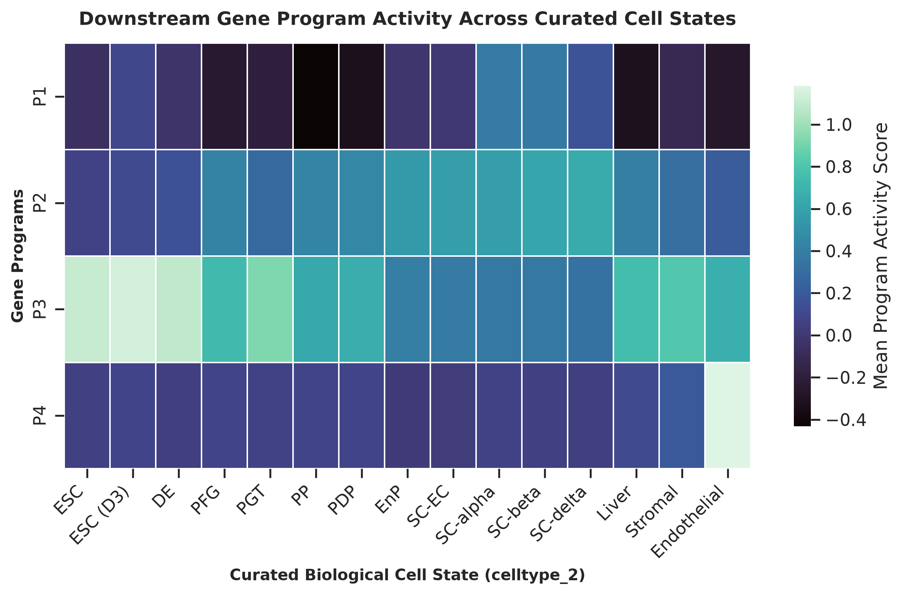

**Figure 14.** Mean per-cell activity score of each gene programme in each curated cell state. Rows: programme P1–P4; columns: cell state in differentiation order; colour: mean activity score on a shared sequential scale. *Source: results/diabetes_specific/figures/16_program_activity_celltype2.png*

**Interpretation.** The unsupervised programmes land where the biology says they should, which is a useful internal validation of the decomposition. P3 (MYC targets, mTORC1, translation; odds ratio 105, FDR 3.5e-36) is highest in ESC, ESC (D3) and DE and declines monotonically into the endocrine states — a proliferative progenitor programme. P2 (Hallmark Pancreas Beta Cells, FDR 1.3e-3) shows the reverse gradient, peaking in SC-delta, SC-beta, SC-alpha and SC-EC. P4 (EMT, angiogenesis, KRAS signalling up) is flat everywhere except Endothelial, where it is by far the highest value in the panel (1.18 versus a next-highest 0.19 in Stromal). P1, the 6-gene residual, is weakly elevated in SC-alpha and SC-beta. Caveat: the colour scale is sequential and shared across rows, so differences within the P1, P2 and P4 rows are compressed by the dominance of P3; a row-scaled version would be easier to read.

### 11.3 Which perturbations drive which programmes

**Table 26.** Co-functional perturbation modules from correlation clustering of the effect matrix. *Source: results/diabetes_specific/tables/module_assignments.csv*

| **Module** | **n** | **Members**                                                                                                                                                                                                                         |
|------------|-------|-------------------------------------------------------------------------------------------------------------------------------------------------------------------------------------------------------------------------------------|
| M1         | 29    | ARX, BMPR1A, FOXA1, FOXA2, GATA4, GATA4het, GATA6, GATA6het, GLIS3, GSC, HHEX, HHEXe, HHEXhet, HNF4A, HNF4Ahet, KDM2B, MNX1, NANOGe-het, NEUROG3, NKX2-2, ONECUT1e, OTUD5, PDX1het, PROSER1, QSER1, QSER1TET1, RFX6, TET1, TET1/2/3 |
| M2         | 1     | TLE3                                                                                                                                                                                                                                |
| M3         | 2     | BCOR, NEUROD1                                                                                                                                                                                                                       |
| M4         | 1     | PDX1                                                                                                                                                                                                                                |
| M5         | 1     | TADA2B                                                                                                                                                                                                                              |
| M6         | 2     | PAX6, PBX1                                                                                                                                                                                                                          |

*The partition is degenerate: 29 of 36 perturbations fall in M1 and four modules are singletons or pairs. The module numbering is also unstable — in the generic-pipeline run of the identical data, PAX6/PBX1 are labelled M3 and NEUROD1/BCOR M6, i.e. the groupings reproduce but the labels swap. Biological names attached to M-numbers in earlier internal documents ('M1 Core Endoderm Drivers', 'M3 Polycomb corepressors', 'M6 Endocrine lineage directors') are therefore interpretive labels, not outputs.*

**Table 27.** Signed regulatory strength linking each perturbation module to each gene programme. *Source: results/diabetes_specific/tables/module_program_strength.csv*

| **Module** | **P1** | **P2** | **P3** | **P4** |
|------------|--------|--------|--------|--------|
| M1         | +0.11  | -0.87  | +0.64  | +0.41  |
| M2         | +0.67  | +0.10  | +0.04  | +0.03  |
| M3         | +0.51  | -0.08  | +0.21  | -0.01  |
| M4         | +0.13  | -0.11  | -0.02  | -0.03  |
| M5         | -0.19  | -0.48  | +0.18  | -0.02  |
| M6         | -0.66  | -0.20  | +0.22  | +0.06  |

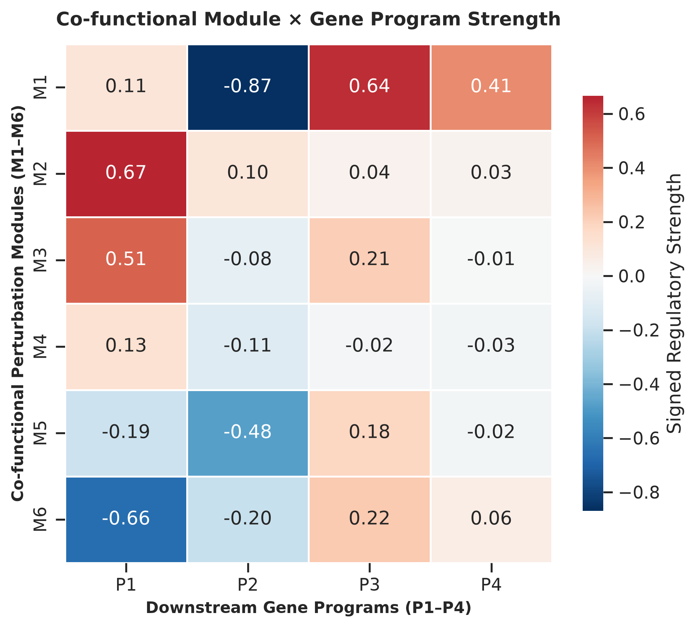

**Figure 15.** Signed regulatory strength of each co-functional module (rows M1–M6) on each downstream gene programme (columns P1–P4). Red = the module's perturbations increase programme activity; blue = decrease. Values printed in cells. *Source: results/diabetes_specific/figures/15_module_program_strength.png*

**Interpretation.** Despite the degeneracy of the module partition, this panel produces one clean, interpretable statement. M1 — the 29-member group containing every early endoderm and pancreatic-progenitor regulator — has the strongest single entry in the matrix on P2 at -0.87: loss of these factors suppresses the beta-cell identity programme. The same module is +0.64 on P3, the proliferative MYC/translation programme. Read together: these perturbations hold cells in a proliferative progenitor programme and prevent them from acquiring the endocrine one, which is precisely the developmental-arrest phenotype that Sections 8.3 and 9.3 detect compositionally. M6 (PAX6, PBX1) is -0.66 on P1 and M2 (TLE3) is +0.67 on P1, so the two late-endocrine modules act on P1 in opposite directions — a potentially interesting observation that cannot be interpreted until P1 (6 genes, unannotated) is resolved.

> **Status of the programme-level analysis**
>
> COMPLETED: effect matrix, gene programmes, programme activity scores, over-representation, module x programme strengths, module network figure. PRELIMINARY: the module partition itself, which is degenerate and label-unstable and should not be used as a biological grouping in its present form; the DistanceSpace phenotype groups of Section 9.4 are the better-behaved grouping of the same 36 perturbations. NOT PERFORMED: per-cell-state differential expression, FR-Perturb, regulon or SCENIC-style inference, and any transcriptome-wide (rather than marker-restricted) programme decomposition. The generic pipeline run additionally emits a TF hub table (results/diabetes/tables/tf_hubs.csv) and a regulome heatmap, but tf_hubs.csv is row-for-row identical to the module assignment table and adds no network information beyond it.

## 12. An integrated perturbation phenotype atlas

The workflow assembles a master table, perturbation_summary.csv, of 37 rows x 27 columns joining every metric. Whether a genotype x cell-state pair can be described by a small set of coordinates — response strength, localisation, displacement, programme — is the question the programme was built to answer, and the answer from the current run is a qualified yes with one coordinate missing.

Four of the five coordinates exist at the resolution needed. Response strength exists per genotype x cell state (271 evaluable cells of the matrix). Localisation exists per genotype x cell state, from two independent tests (lochNESS, 362 evaluable; CMH enrichment, all 540). Programme activity exists per cell state and per module. Displacement exists only per genotype, pooled over all cell states — and Section 9.3 shows that pooling is precisely what makes it a composition statistic. Computing energy distance within cell state, against a state-matched WT reference, is the single change that would complete the atlas.

**Table 28.** Integrated phenotype atlas: all 36 perturbations described by five coordinates. Ordered by energy distance. 'Peak-PS state' is the cell state with the highest median PS among states with >=10 scored cells; 'lochNESS peak state' is the genotype's most common cell state and its mean self-lochNESS there. *Source: perturbation_summary.csv; ps_by_genotype_celltype.csv; phenotype_groups.csv; module_assignments.csv*

| **Genotype** | **n** | **PS med** | **Peak-PS state** | **PS there** | **Energy dist** | **lochNESS peak state** | **mean lochNESS there** | **Module** | **Group** |
|--------------|-------|------------|-------------------|--------------|-----------------|-------------------------|-------------------------|------------|-----------|
| PDX1het      | 469   | —          | —                 | —            | 13.63           | ESC                     | 15.5                    | M1         | PG2       |
| HHEXhet      | 328   | —          | —                 | —            | 10.47           | ESC                     | 6.0                     | M1         | PG1       |
| GATA6        | 1500  | 0.65       | ESC (D3)          | 0.73         | 9.70            | ESC                     | 4.5                     | M1         | PG9       |
| KDM2B        | 182   | 0.68       | ESC               | 0.82         | 9.32            | ESC                     | 8.6                     | M1         | PG1       |
| HHEX         | 1214  | 0.66       | ESC               | 0.78         | 9.00            | ESC                     | 4.1                     | M1         | PG1       |
| GLIS3        | 935   | 0.75       | ESC               | 0.80         | 7.97            | ESC                     | 13.6                    | M1         | PG2       |
| GSC          | 1652  | 0.61       | ESC               | 0.80         | 5.88            | ESC                     | 5.1                     | M1         | PG4       |
| QSER1TET1    | 1157  | —          | —                 | —            | 5.64            | DE                      | 3.6                     | M1         | PG4       |
| HHEXe        | 1487  | —          | —                 | —            | 5.62            | ESC                     | 2.6                     | M1         | PG4       |
| FOXA2        | 4896  | 0.33       | Liver             | 0.70         | 5.45            | Liver                   | 13.7                    | M1         | PG8       |
| GATA4        | 1612  | 0.62       | ESC               | 0.81         | 5.22            | ESC                     | 1.8                     | M1         | PG4       |
| BMPR1A       | 925   | 0.54       | ESC               | 0.74         | 5.01            | ESC                     | 4.1                     | M1         | PG4       |
| GATA6het     | 2266  | —          | —                 | —            | 4.48            | ESC                     | 2.7                     | M1         | PG4       |
| ONECUT1e     | 2436  | —          | —                 | —            | 3.63            | ESC                     | 3.3                     | M1         | PG4       |
| QSER1        | 1232  | 0.54       | ESC               | 0.81         | 3.43            | ESC                     | 2.8                     | M1         | PG4       |
| OTUD5        | 3440  | 0.45       | ESC               | 0.82         | 3.22            | ESC                     | 3.0                     | M1         | PG4       |
| GATA4het     | 1957  | —          | —                 | —            | 2.95            | ESC                     | 1.4                     | M1         | PG4       |
| TET1/2/3     | 948   | —          | —                 | —            | 2.84            | ESC                     | 7.2                     | M1         | PG3       |
| RFX6         | 3331  | 0.45       | ESC               | 0.58         | 2.45            | PFG                     | 3.9                     | M1         | PG3       |
| NEUROG3      | 1543  | 0.44       | ESC               | 0.57         | 2.40            | PDP                     | 3.2                     | M1         | PG3       |
| PDX1         | 6207  | 0.38       | SC-EC             | 0.85         | 2.23            | SC-EC                   | 9.8                     | M4         | PG7       |
| TADA2B       | 1138  | 0.37       | ESC               | 0.79         | 2.21            | ESC                     | 7.3                     | M5         | PG6       |
| PBX1         | 1010  | 0.25       | ESC               | 0.79         | 2.21            | ESC                     | 3.9                     | M6         | PG6       |
| TLE3         | 3259  | 0.16       | SC-beta           | 1.00         | 2.04            | SC-alpha                | 8.2                     | M2         | PG5       |
| TET1         | 1370  | 0.39       | DE                | 0.71         | 2.00            | DE                      | 2.2                     | M1         | PG3       |
| PROSER1      | 2473  | 0.46       | Liver             | 0.66         | 1.80            | PDP                     | 9.6                     | M1         | PG3       |
| NANOGe-het   | 996   | —          | —                 | —            | 1.76            | ESC                     | 8.5                     | M1         | PG3       |
| HNF4Ahet     | 829   | —          | —                 | —            | 1.75            | ESC                     | 1.4                     | M1         | PG3       |
| HNF4A        | 987   | 0.46       | ESC               | 0.79         | 1.68            | ESC                     | 1.5                     | M1         | PG3       |
| ARX          | 2549  | 0.44       | Liver             | 0.59         | 1.51            | PFG                     | 3.1                     | M1         | PG3       |
| FOXA1        | 5668  | 0.43       | ESC (D3)          | 0.80         | 1.47            | PFG                     | 1.4                     | M1         | PG3       |
| NKX2-2       | 5236  | 0.42       | Liver             | 0.63         | 1.46            | PFG                     | 1.4                     | M1         | PG3       |
| NEUROD1      | 2728  | 0.27       | SC-beta           | 0.94         | 1.42            | SC-beta                 | 19.6                    | M3         | PG5       |
| BCOR         | 1240  | 0.35       | PDP               | 0.71         | 1.37            | PDP                     | 3.3                     | M3         | PG5       |
| PAX6         | 3237  | 0.17       | SC-EC             | 0.93         | 1.15            | SC-EC                   | 8.3                     | M6         | PG6       |
| MNX1         | 6451  | 0.47       | ESC (D3)          | 0.70         | 1.08            | PFG                     | 1.1                     | M1         | PG3       |

*Reading across a row gives a phenotype description that no single metric provides. PDX1: moderate displacement (2.23), moderate pooled penetrance (0.38), but near-complete penetrance in SC-EC (0.85) where its cells also aggregate most strongly — a late, lineage-specific phenotype. GLIS3: high on every pooled metric with its peak in ESC — an early arrest. TLE3: near-zero on every pooled metric, complete penetrance in SC-beta — invisible to pooled screening.*

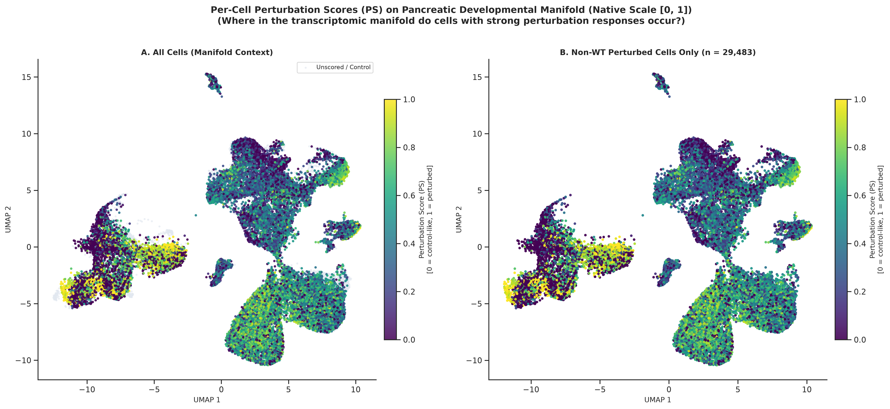

**Figure 16.** Per-cell PS projected onto the UMAP for all scored cells (viridis 0–1); WT and unscored cells shown in pale grey. *Source: results/diabetes_specific/figures/20_umap_ps_score.png*

**Interpretation.** The single-panel version of the argument in Section 8.1: PS is not distributed randomly across the manifold but is organised by cell state, with the endocrine island and parts of the ESC/DE arm carrying most of the high scores and the PP/PDP territory carrying almost none. Because this panel pools all 26 scored genotypes, it should be used as an orientation figure only; the genotype-resolved version (Figure 6) is the one that supports conclusions.

## 13. Biological case studies

Five perturbations are examined in detail. They were selected because each has (i) an unambiguous, independently published phenotype in the precursor study, and (ii) a distinctive and internally consistent signature across the metrics computed here. Together they cover the three mechanistic classes the screen contains: transdifferentiation to a non-pancreatic fate, endocrine sub-lineage redirection, and terminal maturation failure.

### 13.1 GATA6 — transdifferentiation to endothelium

**Prior expectation.** The precursor study reports that GATA6-null hPSCs fail at the definitive-endoderm checkpoint, lose all pancreatic lineages, and convert to CD34+/PECAM1+ endothelial cells. pertTF independently ranked GATA6 as a top hit in its in-silico pancreatic-progenitor screen.

**Table 29.** GATA6 across cell states. Enrichment reference = all other perturbed cells. *Source: ps_by_genotype_celltype.csv; lochness_by_celltype.csv; celltype_enrichment.csv*

| **Cell state** | **Cells** | **Median PS** | **Mean lochNESS** | **% of genotype** | **% of reference** | **log2 OR** | **FDR** | **Sig** |
|----------------|-----------|---------------|-------------------|-------------------|--------------------|-------------|---------|---------|
| ESC            | 517       | 0.709         | +4.53             | 34.47             | 22.51              | +1.31       | 0.0e+00 | yes     |
| DE             | 327       | 0.698         | +18.01            | 21.80             | 18.20              | -1.54       | 0.0e+00 | yes     |
| Endothelial    | 386       | 0.570         | +31.02            | 25.73             | 0.95               | +6.31       | 0.0e+00 | yes     |
| Stromal        | 93        | 0.317         | +1.94             | 6.20              | 5.23               | +0.65       | 1.4e-04 | yes     |
| PDP            | 61        | 0.162         | +0.60             | 4.07              | 8.44               | +0.92       | 2.9e-04 | yes     |
| PP             | 25        | 0.047         | +0.27             | 1.67              | 7.81               | -2.99       | 0.0e+00 | yes     |
| SC-EC          | 2         | —             | —                 | 0.13              | 7.40               | -4.27       | 1.4e-08 | yes     |
| SC-beta        | 3         | —             | —                 | 0.20              | 2.91               | -1.78       | 4.4e-02 | yes     |
| EnP            | 1         | —             | —                 | 0.07              | 1.56               | -3.34       | 9.0e-03 | yes     |

Pooled metrics: 1,500 cells; median PS 0.648 (4th of 26); energy distance 9.704 (3rd of 36, FDR 0.000999); mean self-lochNESS 13.72 (second-highest of 36, marginally behind PDX1het at 13.73); phenotype group PG9 (singleton).

**OBSERVATION.** 386 of 1,500 GATA6 cells (25.7%) are annotated Endothelial against a reference rate of 0.95% (log2 OR +6.31, FDR 0.0, the largest enrichment in the matrix). Their mean self-lochNESS in that state is +31.02 with a positive fraction of 1.000 — every one of the 386 cells sits in a neighbourhood dominated by other GATA6 cells. PS in Endothelial is 0.570 and in ESC/DE is ~0.70. GATA6 is simultaneously depleted from SC-EC (2 cells, log2 OR -4.27), SC-alpha (1 cell, -4.14) and EnP (1 cell, -3.34). **INTERPRETATION.** This is a complete lineage substitution, not a partial defect: the pancreatic endocrine branch is empty and an alternative fate that essentially no other genotype occupies is fully populated. The metrics recover the published phenotype without being told about it, and the near-unity positive lochNESS fraction shows the converted cells form a discrete, self-contained territory rather than a smear.

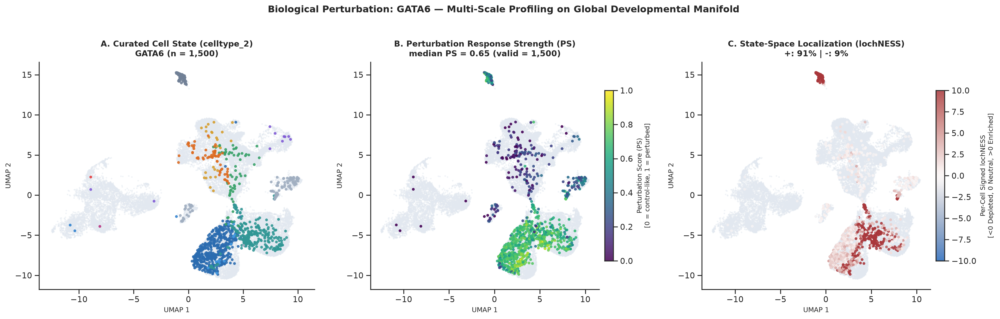

**Figure 17.** GATA6 (n = 1,500) on the global manifold. A: GATA6 cells coloured by curated cell state over a grey background of all cells. B: the same cells coloured by per-cell PS (0–1). C: the same cells coloured by signed self-lochNESS (diverging, clipped at ±10). *Source: results/diabetes_specific/figures/per_genotype_combined/GATA6_ps_lochness_umap.png*

**Interpretation.** Panel A localises GATA6 cells almost entirely to the ESC and DE territories of the progenitor arm, plus the small isolated island at the top of the manifold — the Endothelial cluster. The endocrine island at the left is essentially unoccupied. Panel B shows high PS (green–yellow) through the ESC/DE block, confirming that these are not simply undifferentiated bystanders but cells with a strong transcriptional response. Panel C is saturated red over the endothelial island, the visual form of the +31.0 mean lochNESS in Table 29.

### 13.2 FOXA2 — hepatic diversion at the foregut branch point

**Prior expectation.** FOXA2-null cells pass through definitive endoderm but fail posterior foregut patterning and divert to hepatic progenitors expressing ALB, AFP and APOA1.

**Table 30.** FOXA2 across cell states. *Source: ps_by_genotype_celltype.csv; lochness_by_celltype.csv; celltype_enrichment.csv*

| **Cell state** | **Cells** | **Median PS** | **Mean lochNESS** | **% of genotype** | **% of reference** | **log2 OR** | **FDR** | **Sig** |
|----------------|-----------|---------------|-------------------|-------------------|--------------------|-------------|---------|---------|
| Liver          | 1667      | 0.703         | +13.74            | 34.05             | 1.82               | +4.28       | 0.0e+00 | yes     |
| PGT            | 21        | 0.558         | +11.66            | 0.43              | 0.18               | +0.84       | 3.4e-02 | yes     |
| Endothelial    | 397       | 0.113         | +7.27             | 8.11              | 0.98               | +2.15       | 0.0e+00 | yes     |
| DE             | 861       | 0.251         | +2.00             | 17.59             | 18.32              | -0.26       | 2.9e-02 | yes     |
| PFG            | 494       | 0.410         | +2.40             | 10.09             | 16.21              | -3.27       | 0.0e+00 | yes     |
| ESC            | 962       | 0.279         | +0.67             | 19.65             | 22.94              | -0.06       | 7.1e-01 | no      |
| PP             | 67        | 0.043         | -0.63             | 1.37              | 8.11               | -2.52       | 0.0e+00 | yes     |
| SC-EC          | 33        | 0.000         | -0.65             | 0.67              | 7.70               | -1.77       | 1.1e-12 | yes     |
| SC-beta        | 15        | 0.000         | -0.80             | 0.31              | 3.03               | -1.27       | 1.5e-03 | yes     |
| SC-delta       | 2         | —             | —                 | 0.04              | 0.54               | -1.64       | 1.4e-01 | no      |

Pooled metrics: 4,896 cells; median PS 0.331; energy distance 5.447 (10th of 36); mean self-lochNESS 6.07; phenotype group PG8 (singleton); nearest phenotypic neighbour HHEXe at 3.385, the most isolated non-singleton in the space after GATA6.

**OBSERVATION.** 1,667 of 4,896 FOXA2 cells (34.0%) are Liver against a 1.8% reference rate (log2 OR +4.28, FDR 0.0), with mean self-lochNESS +13.74 and a positive fraction of 0.996. Median PS in Liver is 0.703, the highest of any FOXA2 cell state and more than double its pooled median of 0.331. FOXA2 is also enriched in Endothelial (397 cells, +2.15) and is the only genotype whose lochNESS in PGT reaches +11.66. On the depletion side it is the strongest negative in the whole lochNESS table for SC-delta (-0.85) and SC-beta (-0.80) and is depleted from PFG (log2 OR -3.27). **INTERPRETATION.** The signature is a branch-point failure rather than an arrest: cells traverse DE normally, do not populate PFG, and appear instead in the hepatic and primitive-gut-tube territories that lie on the alternative arm of the same decision. The PS pattern is the strongest evidence here — FOXA2 loss is transcriptionally loudest precisely in the cells that took the wrong branch, which is what one expects if the diverted state is an actively executed alternative programme rather than a passive failure. *Note also that FOXA2 exemplifies the null-allele caveat of Section 5.3: its own transcript is 0.49 log2FC higher in the mutant line, so 28.1% of its cells are classified 'escaper' and its nominal responder fraction collapses to 5.7% despite 33.8% of cells exceeding the PS threshold.*

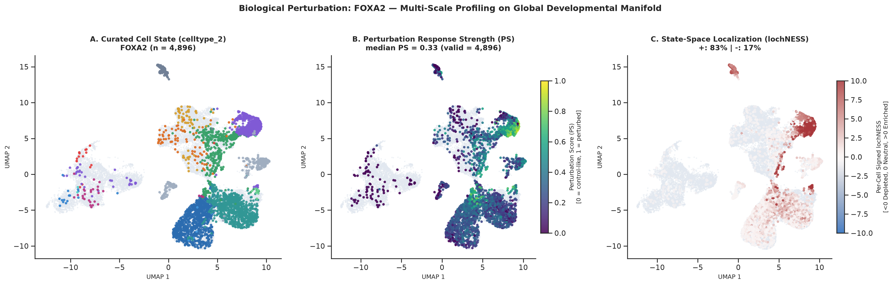

**Figure 18.** FOXA2 (n = 4,896) on the global manifold; panels as in Figure 17. *Source: results/diabetes_specific/figures/per_genotype_combined/FOXA2_ps_lochness_umap.png*

**Interpretation.** Panel A shows FOXA2 cells spread through ESC and DE but concentrated in the Liver territory to the right of the progenitor arm, with a conspicuous absence from the endocrine island. Panel B is brightest over exactly that hepatic territory. Panel C shows the same region saturated. The three panels agree that the phenotype is localised, strong, and directional.

### 13.3 PDX1 — endocrine sub-lineage redirection to SC-EC

**Prior expectation.** PDX1-null cells retain endocrine commitment (CHGA+) but essentially fail to make SC-beta cells and divert stoichiometrically into serotonergic SC-EC cells expressing SLC18A1 and TPH1. PDX1 is also pertTF's flagship unseen-context benchmark and the basis of its T2D primary-islet inference.

**Table 31.** PDX1 across cell states. *Source: ps_by_genotype_celltype.csv; lochness_by_celltype.csv; celltype_enrichment.csv*

| **Cell state** | **Cells** | **Median PS** | **Mean lochNESS** | **% of genotype** | **% of reference** | **log2 OR** | **FDR** | **Sig** |
|----------------|-----------|---------------|-------------------|-------------------|--------------------|-------------|---------|---------|
| SC-EC          | 1576      | 0.852         | +9.79             | 25.39             | 5.72               | +1.49       | 0.0e+00 | yes     |
| PDP            | 1133      | 0.469         | +11.23            | 18.25             | 7.51               | +0.24       | 4.1e-05 | yes     |
| SC-alpha       | 436       | 0.665         | +5.56             | 7.02              | 3.84               | -0.39       | 2.5e-06 | yes     |
| SC-beta        | 65        | 0.722         | +2.89             | 1.05              | 3.02               | -2.93       | 0.0e+00 | yes     |
| EnP            | 156       | 0.546         | +3.51             | 2.51              | 1.44               | -0.13       | 4.0e-01 | no      |
| PP             | 540       | 0.000         | +5.72             | 8.70              | 7.61               | +0.57       | 4.8e-09 | yes     |
| PFG            | 669       | 0.000         | +1.32             | 10.78             | 16.26              | +0.22       | 2.3e-02 | yes     |
| DE             | 608       | 0.000         | +0.65             | 9.80              | 19.00              | +0.84       | 1.5e-06 | yes     |
| ESC            | 859       | 0.000         | +1.16             | 13.84             | 23.50              | -1.04       | 2.8e-08 | yes     |
| Liver          | 48        | 0.000         | -0.20             | 0.77              | 4.08               | -1.88       | 0.0e+00 | yes     |
| Endothelial    | 11        | 0.000         | -0.77             | 0.18              | 1.52               | -2.23       | 1.1e-07 | yes     |

Pooled metrics: 6,207 cells (the second-largest population); median PS 0.378 (19th of 26); energy distance 2.230 (21st of 36); mean self-lochNESS 5.91; module M4 (singleton); phenotype group PG7 (singleton); nearest phenotypic neighbour PAX6 at 1.512.

**OBSERVATION.** PDX1 is a textbook case of a pooled metric hiding a phenotype. It is 21st of 36 on energy distance and 19th of 26 on pooled PS, yet its state-resolved PS is 0.000 in ESC, DE, PFG and PP and 0.852 in SC-EC, 0.722 in SC-beta, 0.665 in SC-alpha and 0.469 in PDP. Its cells aggregate most strongly in PDP (mean lochNESS +11.23, n = 1,133) and SC-EC (+9.79, n = 1,576, positive fraction 0.994). 1,576 of 6,207 cells (25.4%) are SC-EC. Only 65 cells are SC-beta, and PDX1 is significantly depleted from SC-beta, SC-delta, Liver, Stromal and Endothelial in the enrichment test. **INTERPRETATION.** The phenotype is confined to the endocrine compartment and is invisible before it. PDX1-null cells develop normally as far as the pancreatic progenitor stage — which is exactly what a median PS of 0.000 in PFG and PP means — and then, at the endocrine branch point, take the SC-EC route and accumulate in the ductal progenitor state. The SC-EC/SC-beta imbalance reported in the precursor study is reproduced here as an enrichment of +1.49 log2 OR in SC-EC alongside depletion of SC-beta. **HYPOTHESIS.** The high lochNESS in PDP (+11.2 over 1,133 cells) alongside high SC-EC lochNESS is consistent with, but does not establish, an expanded or stalled ductal-progenitor pool feeding the SC-EC diversion. Testing this requires trajectory or RNA-velocity analysis, neither of which has been run.

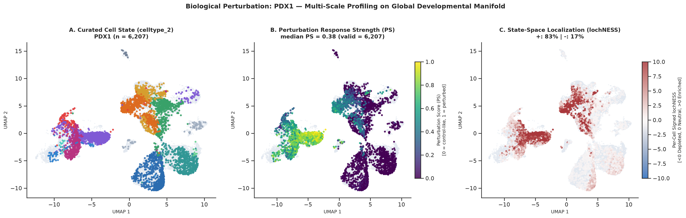

**Figure 19.** PDX1 (n = 6,207) on the global manifold; panels as in Figure 17. *Source: results/diabetes_specific/figures/per_genotype_combined/PDX1_ps_lochness_umap.png*

**Interpretation.** Panel A shows PDX1 cells present across the entire trajectory — they are not arrested — with heavy occupancy of the PDP territory and the SC-EC region of the endocrine island. Panel B is the informative one: the progenitor arm is uniformly dark (PS ~ 0) while the endocrine island is bright, a sharp spatial boundary in response strength that coincides with the endocrine branch point. Panel C shows the corresponding local aggregation in PDP and SC-EC. Comparing panels B and C for this genotype is the clearest available illustration of why PS and lochNESS are uncorrelated across genotypes yet spatially concordant within one.

### 13.4 TLE3 and PAX6 — complete penetrance that pooled screening would miss

These two are grouped because they make the same methodological point in the strongest possible terms, and because the distance space places them close to the same late-endocrine neighbourhood (PAX6's nearest neighbour is PBX1 at 0.882; TLE3's is NEUROD1 at 1.158).

**Table 32.** TLE3 across cell states. *Source: ps_by_genotype_celltype.csv; lochness_by_celltype.csv; celltype_enrichment.csv*

| **Cell state** | **Cells** | **Median PS** | **Mean lochNESS** | **% of genotype** | **% of reference** | **log2 OR** | **FDR** | **Sig** |
|----------------|-----------|---------------|-------------------|-------------------|--------------------|-------------|---------|---------|
| SC-beta        | 248       | 1.000         | +6.13             | 7.61              | 2.66               | +0.57       | 2.2e-07 | yes     |
| SC-alpha       | 584       | 0.993         | +8.16             | 17.92             | 3.50               | +1.73       | 0.0e+00 | yes     |
| SC-delta       | 36        | 0.960         | +3.96             | 1.10              | 0.49               | +0.17       | 5.8e-01 | no      |
| SC-EC          | 372       | 0.848         | +7.29             | 11.41             | 7.09               | -0.33       | 3.9e-04 | yes     |
| EnP            | 85        | 0.658         | +3.27             | 2.61              | 1.48               | +0.00       | 9.8e-01 | no      |
| PDP            | 344       | 0.219         | +2.13             | 10.56             | 8.26               | -0.74       | 0.0e+00 | yes     |
| PFG            | 485       | 0.000         | +0.95             | 14.88             | 15.87              | +0.31       | 1.1e-02 | yes     |
| PP             | 265       | 0.000         | +0.65             | 8.13              | 7.67               | -0.26       | 9.5e-02 | no      |
| DE             | 311       | 0.000         | +0.15             | 9.54              | 18.65              | -0.63       | 3.4e-04 | yes     |
| ESC            | 344       | 0.000         | +0.13             | 10.56             | 23.26              | +0.43       | 1.5e-02 | yes     |

**Table 33.** PAX6 across cell states. *Source: ps_by_genotype_celltype.csv; lochness_by_celltype.csv; celltype_enrichment.csv*

| **Cell state** | **Cells** | **Median PS** | **Mean lochNESS** | **% of genotype** | **% of reference** | **log2 OR** | **FDR** | **Sig** |
|----------------|-----------|---------------|-------------------|-------------------|--------------------|-------------|---------|---------|
| SC-EC          | 828       | 0.932         | +8.27             | 25.58             | 6.48               | +2.43       | 0.0e+00 | yes     |
| EnP            | 128       | 0.711         | +5.48             | 3.95              | 1.42               | +1.05       | 1.1e-13 | yes     |
| SC-beta        | 15        | 0.697         | +0.22             | 0.46              | 2.96               | -3.20       | 0.0e+00 | yes     |
| SC-alpha       | 127       | 0.628         | +6.04             | 3.92              | 4.10               | -0.50       | 8.1e-04 | yes     |
| SC-delta       | 21        | 0.621         | +2.18             | 0.65              | 0.51               | -0.03       | 9.5e-01 | no      |
| PFG            | 585       | 0.031         | +0.81             | 18.07             | 15.73              | +0.37       | 1.2e-03 | yes     |
| PDP            | 145       | 0.049         | -0.10             | 4.48              | 8.52               | -1.58       | 0.0e+00 | yes     |
| DE             | 400       | 0.100         | +0.68             | 12.36             | 18.52              | +0.21       | 3.0e-01 | no      |
| ESC            | 471       | 0.171         | +0.57             | 14.55             | 23.09              | -0.49       | 1.9e-02 | yes     |
| PP             | 272       | 0.000         | +0.40             | 8.40              | 7.66               | -1.04       | 0.0e+00 | yes     |

**OBSERVATION.** TLE3 ranks 26th of 26 on pooled median PS (0.164) and 24th of 36 on energy distance (2.044). Its median PS is 1.000 in SC-beta (n = 248), 0.993 in SC-alpha (n = 584), 0.960 in SC-delta and 0.848 in SC-EC, against 0.000 in ESC, DE, PFG and PP. Its interquartile range across all cells is 0.000–0.894. PAX6 ranks 25th of 26 on pooled PS (0.168) and 35th of 36 on energy distance (1.153), with median PS 0.932 in SC-EC (n = 828) and 0.711 in EnP. Both are significantly enriched in the states where they respond — TLE3 in SC-alpha (+1.73 log2 OR) and PAX6 in SC-EC (+2.43) — and both show high self-lochNESS there (+8.16 and +8.27). **INTERPRETATION.** These are not weak perturbations. They are fully penetrant perturbations of a cell state that constitutes a minority of each genotype's cells, and every pooled statistic divides their true effect by the fraction of cells that had reached the competent state. PAX6's enrichment in SC-EC also reproduces the published SC-beta-to-SC-EC redirection. **This is the concrete evidence for the report's central methodological claim: a perturbation screen scored on pooled per-genotype statistics will systematically discard late-acting regulators, and the two lowest-ranked genes in this screen on both pooled metrics are both established beta-cell regulators.**

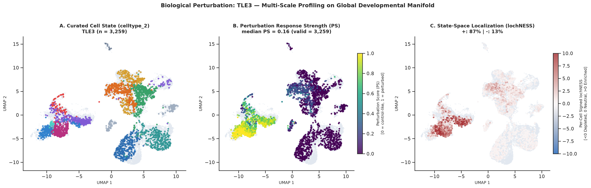

**Figure 20.** TLE3 (n = 3,259) on the global manifold; panels as in Figure 17. *Source: results/diabetes_specific/figures/per_genotype_combined/TLE3_ps_lochness_umap.png*

**Interpretation.** Panel A shows TLE3 cells distributed across the whole trajectory with substantial representation in the endocrine island. Panel B is the point of the figure: the progenitor arm is uniformly black — a median PS of exactly 0.000 in ESC, DE, PFG and PP — while the endocrine island is uniformly bright yellow at PS ~ 1.0. There is no gradient between them. This is the cleanest visual demonstration in the dataset that response strength is gated by cell state, and it is the phenotype that a genotype-level median of 0.164 summarises away.

### 13.5 NEUROG3 and NEUROD1 — a developmental block and a maturation failure, distinguished

These two act at consecutive points in the endocrine cascade and the metrics separate their phenotypes cleanly, which is a useful demonstration that the readouts distinguish 'the cell never got there' from 'the cell got there and is wrong'.

**Table 34.** NEUROG3 across cell states. *Source: ps_by_genotype_celltype.csv; lochness_by_celltype.csv; celltype_enrichment.csv*

| **Cell state** | **Cells** | **Median PS** | **Mean lochNESS** | **% of genotype** | **% of reference** | **log2 OR** | **FDR** | **Sig** |
|----------------|-----------|---------------|-------------------|-------------------|--------------------|-------------|---------|---------|
| PDP            | 333       | 0.421         | +3.23             | 21.58             | 8.09               | +2.00       | 0.0e+00 | yes     |
| PP             | 203       | 0.151         | +2.32             | 13.16             | 7.58               | +1.44       | 0.0e+00 | yes     |
| SC-alpha       | 18        | 0.000         | +7.65             | 1.17              | 4.15               | -2.26       | 5.1e-12 | yes     |
| SC-EC          | 5         | —             | —                 | 0.32              | 7.40               | -5.14       | 0.0e+00 | yes     |
| SC-beta        | 0         | —             | —                 | 0.00              | 2.92               | -6.54       | 6.7e-14 | yes     |
| SC-delta       | 1         | —             | —                 | 0.06              | 0.52               | -3.30       | 1.1e-02 | yes     |
| EnP            | 9         | —             | —                 | 0.58              | 1.55               | -1.66       | 8.1e-04 | yes     |
| PFG            | 287       | 0.415         | +1.03             | 18.60             | 15.77              | +0.79       | 2.4e-07 | yes     |
| DE             | 263       | 0.459         | +0.86             | 17.04             | 18.30              | -0.27       | 2.5e-01 | no      |
| ESC            | 303       | 0.565         | +1.03             | 19.64             | 22.80              | +0.17       | 4.9e-01 | no      |

**Table 35.** NEUROD1 across cell states. *Source: ps_by_genotype_celltype.csv; lochness_by_celltype.csv; celltype_enrichment.csv*

| **Cell state** | **Cells** | **Median PS** | **Mean lochNESS** | **% of genotype** | **% of reference** | **log2 OR** | **FDR** | **Sig** |
|----------------|-----------|---------------|-------------------|-------------------|--------------------|-------------|---------|---------|
| SC-beta        | 464       | 0.936         | +19.56            | 17.01             | 2.36               | +2.83       | 0.0e+00 | yes     |
| SC-alpha       | 138       | 0.694         | +3.95             | 5.06              | 4.06               | -0.37       | 1.2e-02 | yes     |
| SC-delta       | 17        | 0.627         | +2.38             | 0.62              | 0.51               | -0.36       | 4.0e-01 | no      |
| SC-EC          | 100       | 0.361         | +1.20             | 3.67              | 7.39               | -1.88       | 0.0e+00 | yes     |
| EnP            | 43        | 0.206         | +2.30             | 1.58              | 1.53               | -0.48       | 5.8e-02 | no      |
| PDP            | 294       | 0.311         | +1.19             | 10.78             | 8.27               | -0.27       | 1.2e-02 | yes     |
| PP             | 266       | 0.000         | +0.73             | 9.75              | 7.62               | +0.52       | 9.5e-04 | yes     |
| PFG            | 391       | 0.036         | +0.44             | 14.33             | 15.88              | +0.17       | 2.5e-01 | no      |
| DE             | 431       | 0.204         | +0.62             | 15.80             | 18.36              | +0.19       | 3.3e-01 | no      |
| ESC            | 395       | 0.324         | +0.54             | 14.48             | 23.03              | -0.33       | 9.1e-02 | no      |

**OBSERVATION — NEUROG3.** Zero of 1,543 NEUROG3 cells are SC-beta (log2 OR -6.54, FDR 6.7e-14, the strongest depletion in the matrix) and only 5 are SC-EC (-5.14). Its cells instead accumulate in PDP (333 cells, +2.00 log2 OR, lochNESS +3.23) and PP. Median PS is 0.440 with a narrow interquartile range (0.265–0.557) and no state-specific hotspot. **OBSERVATION — NEUROD1.** 464 of 2,728 NEUROD1 cells (17.0%) are annotated SC-beta against a 2.4% reference rate — an enrichment (+2.83 log2 OR), not a depletion. Those SC-beta cells have a mean self-lochNESS of +19.56 with a positive fraction of 1.000, and a median PS of 0.936. **INTERPRETATION.** NEUROG3 loss blocks endocrine specification outright: cells never reach the endocrine states, so there is nothing there to score, and the phenotype registers as a pile-up in the ductal-progenitor pool plus a uniform, moderate transcriptional response upstream. NEUROD1 loss does the opposite. Cells do become SC-beta by the annotation, in above-normal numbers, but every one of them sits in a dense neighbourhood populated exclusively by other NEUROD1 cells and carries a near-maximal perturbation score. **A lochNESS of +19.6 with a positive fraction of 1.000 in a state where the annotation says the cells are normal is a specific and falsifiable signature: it says the annotation is being satisfied by marker genes while the underlying transcriptome is a distinct, mutant-only state.** This is consistent with the precursor observation that residual NEUROD1 beta cells lose INS and the insulin-secretion machinery. **HYPOTHESIS.** NEUROD1-null 'SC-beta' cells constitute an arrested immature beta-like state rather than mature SC-beta. Confirming this requires targeted differential expression of maturation markers (INS, MAFA, SLC30A8, G6PC2) within the SC-beta compartment, comparing NEUROD1 to WT — an analysis this project has not run.

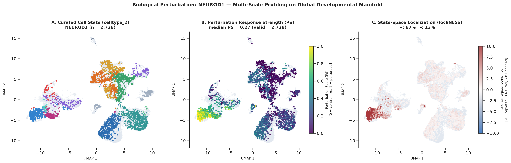

**Figure 21.** NEUROD1 (n = 2,728) on the global manifold; panels as in Figure 17. *Source: results/diabetes_specific/figures/per_genotype_combined/NEUROD1_ps_lochness_umap.png*

**Interpretation.** Panels B and C together are the evidence for the hypothesis above. The SC-beta lobe of the endocrine island carries both the brightest PS values in the panel and a saturated lochNESS signal, meaning those cells are simultaneously maximally displaced along the NEUROD1 perturbation axis and surrounded almost exclusively by other NEUROD1 cells. Cells that were genuinely normal SC-beta would show neither.

### 13.6 What the five cases have in common

Each of the five phenotypes was independently characterised in the precursor study by manual analysis, and each is recovered here by unsupervised, uniformly applied metrics that were given no prior information about which gene does what. That is the strongest available evidence that the pipeline measures real biology. It also identifies which readout carries the signal in each case, which is directly useful for designing the next screen:

-   Transdifferentiation (GATA6, FOXA2) is loudest in cell-state enrichment and in state-resolved lochNESS, and is also detectable in pooled energy distance.

-   Sub-lineage redirection (PDX1, PAX6) is loudest in state-resolved PS and in enrichment, and is largely invisible in pooled energy distance.

-   Maturation failure (NEUROD1) is invisible in cell-state composition — the cells are there, in above-normal numbers — and is detectable only in state-resolved PS and lochNESS.

-   Developmental block (NEUROG3, BMPR1A) is visible only as depletion, which means only the enrichment test captures it; PS and lochNESS have no cells to score in the missing state.

## 14. What this adds to pertTF

pertTF is not deficient in what it set out to do. It classifies cell type and genotype, predicts expression under held-out gene and held-out context regimes, predicts lochNESS composition shifts, and transfers across perturbation modality and to primary tissue. The point of the analyses audited here is that the object being predicted was, until now, only partly described.

**Table 36.** What each layer of the programme provides.

| **Question**                                  | **pertTF**                                                                               | **This work**                                                    |
|-----------------------------------------------|------------------------------------------------------------------------------------------|------------------------------------------------------------------|
| What happens after perturbation X?            | Predicted expression vector, embedding, cell-type and genotype label; predicted lochNESS | —                                                                |
| How strongly does an individual cell respond? | Not represented explicitly                                                               | PS in [0,1] per cell, 66,015 cells, 26 genotypes               |
| Is the response uniform across cells?         | Not represented explicitly                                                               | PS distribution shape; IQR 0.25 (GATA6) to 0.89 (TLE3)           |
| Where on the manifold does the effect occur?  | Predicted lochNESS (composition shift)                                                   | Observed lochNESS per cell; 362 evaluable genotype x state cells |
| Which cell states are gained or lost?         | Implied by predicted lochNESS                                                            | CMH enrichment, 313/540 significant, 118 up 195 down             |
| How far has the population moved?             | Not represented explicitly                                                               | Energy distance vs WT, permutation-tested, all 36 significant    |
| Which programmes carry the change?            | Implicit in the predicted vector                                                         | 4 programmes on a 36 x 980 effect matrix; 3 annotated            |
| Is the effect stage-specific?                 | Testable by held-out context benchmarks, not quantified as a phenotype                   | PS and lochNESS resolved per cell state; the central result      |

Two of these are worth stating as explicit contributions rather than as gaps filled.

**First, response penetrance is a measured quantity and it is gated by cell state.** A model that predicts the mean perturbed profile for genotype g in cell state c is predicting the mean of a distribution that, for PDX1, TLE3 and PAX6, is bimodal across states and nearly degenerate within them. The per-genotype x per-cell-state PS matrix (271 evaluable entries) is a supervision target that encodes this and is not currently used.

**Second, the observed lochNESS that pertTF was trained to predict has properties that constrain the task.** As implemented it is a self-score, bounded below at -1, unbounded above, and scaled by the inverse of each perturbation's global abundance. A regression target with those properties will be dominated by rare perturbations in abundant neighbourhoods, and reported correlations against it should be interpreted with that in mind. A symmetrised or log-ratio formulation would be better behaved; this is a concrete, low-cost suggestion that follows directly from the audit rather than from theory.

The honest framing for a manuscript is therefore: pertTF predicts what happens; this work measures how much, to how many cells, where, and in which programmes — and finds that the answer to 'how much' is meaningless unless 'where' is answered first.

## 15. Current limitations

### 15.1 Design and reference

-   Non-matched WT reference. 74.7% of WT cells come from six WT-only samples. Every WT-referenced quantity is partly a between-sample comparison, and the six WT-only strata contribute nothing to the sample-stratified enrichment test. Severity: high; affects Sections 6, 9 and the WT-referenced half of 8.3.

-   Composition dominates energy distance (Spearman rho = +0.88 with the dominant-state fraction). The quantity is informative but is not a measure of transcriptional severity. Severity: high; affects Sections 6, 9, 10 and any downstream ranking.

-   The dominant-state fraction and the ESC-stage fraction are themselves correlated with cell count (small populations are more skewed), so cell count, composition and distance form a single confounded block that cannot be fully disentangled with 36 points.

### 15.2 Metric construction

-   Ten of 36 genotypes have no PS value, for a gene-symbol lookup reason, not a biological one. These include the entire heterozygous allelic series (PDX1het, HHEXhet, GATA4het, GATA6het, HNF4Ahet, NANOGe-het), both enhancer deletions (HHEXe, ONECUT1e) and both compound knockouts (QSER1TET1, TET1/2/3) — i.e. exactly the genotypes needed for dosage and epistasis questions.

-   PS responder fraction requires the target transcript to fall, which null alleles need not do. Use pct_high_ps instead (Section 5.3).

-   lochNESS as summarised is a self-score with a -1 floor, so it measures aggregation rather than two-sided enrichment and cannot express depletion magnitude. The 'negative lochNESS is decoupled from everything' conclusion is confounded with this floor.

-   lochNESS scales inversely with a perturbation's global abundance, so rare genotypes score higher by construction (rho = -0.38 with cell count).

-   Energy distance is computed as the biased V-statistic (self-distances retained in the within-group means). The bias is small at these sample sizes but is largest exactly where the extreme values are, in the smallest groups.

-   All 36 DistanceTest results sit at the 1,000-permutation resolution floor, so the FDR column carries no information about relative confidence.

### 15.3 Clustering and programmes

-   Co-functional modules are degenerate (29/36 in M1) and the M-numbering is not reproducible between two runs of the same data. Use the DistanceSpace phenotype groups instead.

-   Gene programmes are derived within a 980-gene cell-state marker space, so they are cell-identity programmes by construction and the over-representation background is that restricted set.

-   P1 contains 6 genes and reaches no significant annotation; it should not be described as a biological programme.

### 15.4 Analyses not performed

-   No stage- or state-stratified energy distance, which is the analysis the composition confound calls for.

-   No per-cell-state differential expression; the effect matrix is computed pooled across states.

-   No trajectory, pseudotime or RNA-velocity analysis, so 'diversion' and 'arrest' are inferred from composition and localisation rather than demonstrated dynamically.

-   No FR-Perturb, no regulon/SCENIC inference, no gene-regulatory-network reconstruction. The tf_hubs table emitted by the generic run duplicates the module assignments and contains no network information.

-   No guide-level concordance analysis. The enrichment table has guides_concordant and guides_tested columns and both are entirely NaN, because genotype is a clonal-line label rather than a multi-guide target; clone-level reproducibility within a genotype has therefore not been assessed here even though the precursor study reports it.

-   No direct comparison against pertTF predictions on the same cells. The observed PS, lochNESS and enrichment matrices exist; the predicted counterparts have not been joined to them.

## 16. Status ledger

**Table 37.** Completion status of every analysis referenced in this report.

| **Analysis**                                           | **Status**                | **Evidence / note**                                                                               |
|--------------------------------------------------------|---------------------------|---------------------------------------------------------------------------------------------------|
| Data validation and QC inventory                       | COMPLETED                 | run log 19816263; qc_\*.csv                                                                      |
| PCA / manifold construction                            | COMPLETED                 | run log 13:23:03–13:23:22; X_pca 111581x50                                                       |
| Per-cell PS scoring                                    | COMPLETED (26/36)         | ps_score_summary.csv (26 rows); ps_score_skipped.csv (10 rows)                                |
| PS by genotype                                         | COMPLETED                 | ps_by_genotype.csv                                                                              |
| PS by cell state and by stage                          | COMPLETED                 | ps_by_celltype2.csv; ps_by_development_stage.csv                                             |
| PS by genotype x cell state                            | COMPLETED                 | ps_by_genotype_celltype.csv (505 rows; 271 with >=10 valid)                                 |
| lochNESS (k = 300, X_pca)                             | COMPLETED (36/36)         | run log 13:25:22–13:28:27; obs['lochness_self'] on all 111,581 cells                           |
| lochNESS by genotype / state / stage                   | COMPLETED                 | lochness_by_genotype.csv; _by_celltype2.csv; _by_celltype.csv; _by_development_stage.csv |
| Energy distance + permutation DistanceTest             | COMPLETED (36/36)         | distance_results.csv; all FDR = 0.000999                                                         |
| DistanceSpace (630 pairs, PCoA, groups)                | COMPLETED                 | distance_space_matrix/_coordinates/_neighbors.csv; phenotype_groups.csv (9 groups)           |
| Cell-state enrichment (CMH, both references)           | COMPLETED                 | celltype_enrichment.csv (1,080 rows = 540 x 2 references)                                        |
| Effect matrix + gene programmes                        | COMPLETED                 | gene_programs.csv (980 genes, 4 programmes); program_activity_celltype.csv                     |
| Programme pathway over-representation                  | COMPLETED (3/4 annotated) | —                                                                                                 |
| Co-functional module partition                         | PRELIMINARY               | module_assignments.csv — 29/36 in M1; labels differ between runs                                 |
| Master integrated summary table                        | COMPLETED                 | perturbation_summary.csv (37 x 27)                                                               |
| 28 primary figures + 98 per-genotype panels            | COMPLETED                 | figure_manifest.json: 28 attempted, 28 generated, 0 failed                                       |
| Direct target-transcript knockdown test                | COMPLETED (generic run)   | results/diabetes/tables/perturbation.csv — 13/26 effective; see Section 5.3                       |
| Cross-metric correlation analysis                      | COMPLETED                 | reproduces Quantitative_Claim_Audit.md rows 31–38 exactly                                       |
| Composition-conditioned (partial) correlation analysis | COMPLETED (this audit)    | Section 10.2; recomputed here, not in any repository output                                       |
| Stage/state-stratified distance                        | PLANNED                   | no output files exist                                                                             |
| Per-cell-state differential expression                 | PLANNED                   | no output files exist                                                                             |
| Trajectory / velocity                                  | PLANNED                   | no output files exist                                                                             |
| FR-Perturb                                             | PLANNED                   | no output files exist; not implemented in the pipeline                                            |
| Regulon / GRN inference                                | PLANNED                   | no output files exist; tf_hubs.csv duplicates module_assignments.csv                            |
| Clone-level reproducibility within genotype            | PLANNED                   | guides_concordant / guides_tested are all NaN in celltype_enrichment.csv                       |
| Join to pertTF predictions                             | PLANNED                   | no output files exist                                                                             |

> **What is not in this repository, contrary to earlier internal documents**
>
> WIP_scientific_reading.md and Master_Scientific_Story.md refer to cNMF-derived gene programmes and to Louvain clustering of perturbation modules. The implementation in src/perturbseq_pipeline/modules.py uses correlation clustering of a log2FC effect matrix with average linkage, not cNMF and not Louvain. Master_Scientific_Story.md additionally attributes SCENIC+ regulon and cNMF analyses to the precursor study; those belong to the precursor paper, not to this pipeline, and no regulon output exists here. Mixscape is referenced as the basis of PS; the implementation is pertps 0.1.0, an scMAGeCK-style signature projection, which is related but not identical.

## 17. Proposed next analyses, in priority order

#### Priority 1 — State-stratified distance against a matched reference

Recompute energy distance and the DistanceTest within each cell state, comparing genotype-g cells in state c against WT cells in state c drawn from the same samples where possible. This converts the metric from a composition statistic into a measure of within-state transcriptional displacement, removes the confound documented in Section 9.3, and produces a 36 x 15 displacement matrix that matches the resolution of the existing PS and lochNESS matrices. Cost: low — the machinery exists (compute_energy_distance operates on any two index sets); the only new work is the stratified loop and the 10-cell minimum. This single change completes the integrated atlas of Section 12.

#### Priority 2 — Fix the two metric-construction issues

-   Map non-symbol genotype labels to their target genes so the ten missing genotypes get PS values (PDX1het to PDX1, GATA6het to GATA6, HHEXe to HHEX, QSER1TET1 to QSER1 and TET1, TET1/2/3 to TET1/TET2/TET3, ONECUT1e to ONECUT1, NANOGe-het to NANOG). The sanitize_identifier helper already exists for the HDF5 side of the same problem. This restores the entire dosage series to the analysis.

-   Report and plot pct_high_ps rather than ps_responder_fraction throughout, and add the control false-positive rate (pct_controls_called_kd, median 8.7%) as a reference line on PS figures.

#### Priority 3 — Per-cell-state differential expression and programme scoring

The effect matrix is currently pooled across cell states, which means the programmes describe the average perturbation effect over a mixture. Recomputing log2FC within each state — starting with the states the case studies identify (SC-EC, SC-beta, PDP, Liver, Endothelial) — would let the programme decomposition answer the question the case studies raise: is NEUROD1-null SC-beta a distinct state, and which maturation genes define it? The specific first test is INS, MAFA, SLC30A8 and G6PC2 in SC-beta, NEUROD1 versus WT.

#### Priority 4 — Symmetrise and validate the lochNESS formulation

Compute lochNESS against a matched WT neighbourhood fraction rather than against the perturbation's global abundance, and report it on a log scale so that enrichment and depletion are symmetric. Validate by checking that the abundance dependence (currently rho = -0.38 with cell count) is removed. This also improves the regression target pertTF is trained on.

#### Priority 5 — Join observed to predicted

The observed PS, lochNESS and enrichment matrices computed here are the natural evaluation set for pertTF. Scoring pertTF's predicted lochNESS against the observed genotype x cell-state matrix (362 evaluable entries) would give a state-resolved accuracy breakdown rather than a single correlation, and would show directly whether the model's errors concentrate in the rare states where the interesting biology sits.

#### Priority 6 — Trajectory analysis to test the diversion hypotheses

Every 'diversion' claim in Section 13 is currently inferred from static composition and neighbourhood structure. Pseudotime or RNA velocity on the PDX1, PAX6 and RFX6 populations would test whether SC-EC cells branch from the same NEUROG3+ progenitor pool as SC-beta cells, which is the mechanistic claim the precursor study makes and which this analysis is consistent with but does not establish.

#### Lower priority

-   Replace the degenerate module partition with the DistanceSpace phenotype groups, or recompute modules on a state-stratified effect matrix where the perturbations are more separable.

-   Increase the DistanceTest permutation budget so the FDR column becomes informative for the top genotypes.

-   Fix the two figure defects identified in the audit: the duplicated SC-EC/Liver colour in CELLTYPE_PALETTE, and the 'Enrichment vs WT' colour-bar label on Figure 8, which plots the 'other' reference.

## 18. Conclusions

1.  Every one of the 36 perturbations produces a statistically detectable population phenotype (energy distance from WT, 1,000-permutation test, all FDR = 0.000999). Detection is not the limiting problem in this dataset.

2.  Response strength is gated by cell state, and this is the programme's principal finding. PDX1, PAX6, TLE3 and NEUROD1 have median PS values indistinguishable from zero in progenitor states and 0.72–1.00 in the endocrine states where those factors act. TLE3 ranks last of 26 genotypes on pooled median PS and has a median PS of 1.000 in SC-beta.

3.  Because of point 2, per-genotype summary statistics are not a sound basis for ranking perturbations in a differentiation screen. The two lowest-ranked genes on both pooled metrics in this screen, TLE3 and PAX6, are both established beta-cell regulators with near-complete penetrance in the states where they act.

4.  The metrics are complementary, but less symmetrically than earlier internal readings concluded. PS and lochNESS are genuinely independent across genotypes (rho = +0.06, p = 0.77). The apparent strong coupling of PS and energy distance (rho = +0.64) does not survive conditioning on cell-state composition (partial rho = +0.37, p = 0.063), because both load on the same compositional axis.

5.  Energy distance from WT, as computed here, is a composition statistic (rho = +0.88 with the dominant-state fraction). It measures developmental arrest and lineage diversion rather than within-state transcriptional severity. Named correctly it is useful; named 'global phenotype magnitude' it is misleading, and one published internal claim — PDX1 dosage sensitivity inferred from PDX1het's rank-1 distance — does not survive the correction.

6.  The unsupervised readouts recover known biology without supervision: GATA6 to endothelium, FOXA2 to liver, PDX1 and PAX6 to SC-EC, NEUROG3 blocking endocrine specification entirely, and HNF4A/HNF4Ahet as each other's nearest phenotypic neighbours at the smallest distance in the 630-pair matrix. This is the strongest evidence that the pipeline is measuring what it claims to measure.

7.  One new, testable observation emerges that the precursor analysis frames differently: NEUROD1-null cells are enriched, not depleted, in the SC-beta annotation (17.0% versus 2.4%), but those cells carry a mean self-lochNESS of +19.6 with a positive fraction of 1.000 and a median PS of 0.936. They satisfy the SC-beta annotation while occupying a transcriptional neighbourhood populated exclusively by other NEUROD1 cells. The hypothesis that this is an arrested immature beta-like state is directly testable by maturation-marker differential expression within the SC-beta compartment.

8.  The framework is close to producing a genuinely multi-coordinate phenotype description. Four of the five coordinates already exist at genotype x cell-state resolution; displacement does not, and computing it state-stratified against a matched reference is both the analysis that completes the atlas and the analysis that removes the largest confound in the current results.

**The revised conceptual model the evidence supports:**

*Cell state gates response strength (PS, resolved per state). Response strength and localisation together determine where the perturbed population sits on the manifold (lochNESS, enrichment). Compositional redistribution across states is what population-level displacement measures (energy distance, once its confound is acknowledged). Coordinated gene programmes describe the direction of travel — loss of the beta-cell identity programme, retention of the proliferative progenitor programme. The developmental phenotype is the conjunction of all four, and no single one of them ranks the perturbations correctly on its own.*

## Appendix A — Provenance and file inventory

### A.1 Code

**Table 38.** Code touching the diabetes analyses.

| **Path**                                        | **Role**                                                                         |
|-------------------------------------------------|----------------------------------------------------------------------------------|
| workflows/diabetes_analysis.py                 | Bespoke diabetes workflow: 4,456 lines; 28 figure functions; recovery mode       |
| workflows/run_diabetes_analysis.slurm         | SLURM submission: 48 CPUs, 256 GB, 8 h; seed 123; 1,000 permutations             |
| src/perturbseq_pipeline/ps_score.py           | PS via pertps 0.1.0; quadrant classification                                     |
| src/perturbseq_pipeline/lochness.py            | lochNESS; Numba-accelerated neighbour counting; self-score storage               |
| src/perturbseq_pipeline/distance.py            | Energy distance, MMD, permutation test, DistanceSpace, PCoA                      |
| src/perturbseq_pipeline/enrichment.py          | CMH stratified enrichment; both control references; BH FDR                       |
| src/perturbseq_pipeline/modules.py             | Effect matrix, programme and module clustering, module x programme strength      |
| src/perturbseq_pipeline/gene_sets.py          | Hallmark / Reactome / GO BP over-representation                                  |
| src/perturbseq_pipeline/cluster.py             | HVG selection, PCA, normalisation                                                |
| src/perturbseq_pipeline/config.py              | Config dataclasses and defaults (source of primary_control = 'other')           |
| config/diabetes.yaml                            | Configures the GENERIC pipeline run (results/diabetes), not the bespoke workflow |
| diabetes_mapping.py / check_h5ad_diabetes.py | Ad-hoc dataset inspection scripts                                                |
| tests/test_diabetes_analysis.py               | Unit tests for the diabetes workflow                                             |
| results/diabetes_specific/presentation/        | Deck builders, figure inventories, manuscript readings, claim audits             |

### A.2 Result tables used in this report

**Table 39.** Result tables from the bespoke run (job 19816263, 2026-08-30 13:22–13:43).

| **File (results/diabetes_specific/tables/)** | **Rows** | **Used in** |
|-----------------------------------------------|----------|-------------|
| perturbation_summary.csv                     | 37       | 1, 10, 12   |
| ps_score_summary.csv                        | 26       | 5.3, 7      |
| ps_score_skipped.csv                        | 10       | 5.3, 7      |
| ps_by_genotype.csv                          | 36       | 7           |
| ps_by_celltype2.csv                         | 15       | 8.1         |
| ps_by_development_stage.csv                | 6        | 8.4         |
| ps_by_genotype_celltype.csv                | 505      | 8.1, 13     |
| lochness_summary.csv                         | 36       | 8.2         |
| lochness_by_genotype.csv                    | 36       | 8.2         |
| lochness_by_celltype2.csv                   | 15       | 8.2         |
| lochness_by_celltype.csv                    | 505      | 8.2, 13     |
| lochness_by_development_stage.csv          | 5        | 8.4         |
| distance_results.csv / distance_test.csv    | 36       | 6, 9        |
| distance_space_matrix.csv                   | 36       | 9.3, 9.4    |
| distance_space_coordinates.csv              | 36       | 9.4         |
| distance_space_neighbors.csv                | 360      | 9.4         |
| phenotype_groups.csv                         | 36       | 9.4         |
| celltype_enrichment.csv                      | 1080     | 8.3, 13     |
| module_assignments.csv                       | 36       | 11.3        |
| module_program_strength.csv                 | 6        | 11.3        |
| gene_programs.csv                            | 980      | 11.2        |
| program_summary.csv                          | 4        | 11.2        |
| program_enrichment.csv                       | 105      | 11.2        |
| program_activity_celltype.csv               | 4        | 11.2        |
| per_genotype_umap_manifest.csv             | 36       | figures     |

**Table 40.** Tables from the generic-pipeline run of the same data (2026-08-29 19:00–19:21), used where the bespoke workflow does not emit an equivalent.

| **File (results/diabetes/tables/)** | **Rows** | **Used in** |
|-------------------------------------|----------|-------------|
| qc_summary.csv                     | 14       | 5.1         |
| qc_steps.csv                       | 1        | 5.1         |
| guide_qc.csv                       | 5        | 5.2         |
| guide_assignment.csv               | 37       | 5.2         |
| assignment_per_lane.csv           | 13       | 3.2         |
| clusters.csv                        | 29       | —           |
| perturbation.csv                    | 26       | 5.3         |
| skipped.csv                         | 10       | 5.3         |
| enrichment_full.csv                | 1080     | 8.3         |
| effect_matrix.csv                  | 36       | 11.1        |
| tf_hubs.csv                        | 36       | 15.4        |

*The generic run used config/diabetes.yaml, in which lochNESS was disabled (an HDF5 column-name issue with the genotype 'TET1/2/3', documented in the YAML). The bespoke workflow solves this with sanitize_identifier() and runs lochNESS successfully. The two runs otherwise agree: 36/36 significant distances, the same 10 PS-skipped genotypes, and the same perturbation groupings under different module labels.*

### A.3 Figures

Figures 1–21 in this document are unmodified PNG files from results/diabetes_specific/figures/ and results/diabetes/figures/qc/; each figure caption names its source path. The complete figure set comprises 28 numbered primary figures, 26 per-genotype PS UMAPs, 36 per-genotype lochNESS UMAPs, 36 combined three-panel per-genotype UMAPs, and two multi-panel atlases (PS and lochNESS), each written as both PNG and PDF. figure_manifest.json records 28 attempted, 28 generated, 0 failed. [*Corrected during Markdown conversion: the Word report reads 'three multi-panel atlas PDFs'; `figures/` contains two atlas figures, `ps_per_genotype_umap_atlas` and `lochness_per_genotype_umap_atlas`, in PNG and PDF form.*]

### A.4 Primary figures not used in the main narrative, and why

**Table 41.** Figure audit: primary outputs not promoted to the main narrative.

| **Figure**                                                                                      | **Disposition**                                         | **Reason**                                                                                                                                                                                                                                 |
|-------------------------------------------------------------------------------------------------|---------------------------------------------------------|--------------------------------------------------------------------------------------------------------------------------------------------------------------------------------------------------------------------------------------------|
| 02_umap_development_stage                                                                    | Supplementary                                           | Duplicates Figure 2 in a less quantitative form.                                                                                                                                                                                           |
| 08 / 09 / 10 / 11 (distance and PS vs signed lochNESS)                                          | Supplementary (08 and 10) / not recommended (09 and 11) | Panels 09 and 11 plot mean NEGATIVE lochNESS, which is compressed into a 0.26-wide band against the -1 floor (Section 8.2); the scatter is uninterpretable. Panels 08 and 10 (positive lochNESS) are sound but are summarised by Figure 9. |
| 17_program_enrichment                                                                         | Supplementary                                           | Bar chart of programme terms; the same content is in Table 25 with exact FDRs.                                                                                                                                                             |
| 18_module_network                                                                             | Not recommended                                         | Network layout of a partition that is 29/36 one module (Section 11.3); the layout implies structure the clustering does not support.                                                                                                       |
| 21_umap_lochness_score                                                                       | Supplementary                                           | Panel B of Figure 13 already shows this on the same coordinates.                                                                                                                                                                           |
| 22_ps_by_genotype / 23_ps_by_celltype2                                                    | Redundant                                               | Bar and box versions of ps_by_genotype.csv and ps_by_celltype2.csv, both reported as tables.                                                                                                                                           |
| 25 / 26 (lochNESS by genotype / cell state)                                                     | Redundant                                               | Same data as Table 14 and Figure 7 at lower resolution.                                                                                                                                                                                    |
| 28_umap_highlight_genotypes                                                                  | Supplementary                                           | Useful for orientation in a talk; adds nothing over the per-genotype panels used in Section 13.                                                                                                                                            |
| per_genotype_ps/\*, per_genotype_lochness/\* (62 panels)                                    | Supplementary reference set                             | One panel per genotype; the combined three-panel version is used for the five case studies.                                                                                                                                                |
| results/diabetes/figures/\* (generic run: clustering, enrichment, modules, ps_score, distance) | Supplementary / superseded                              | Generated from the run in which lochNESS was disabled; the bespoke run supersedes them. The QC violin (Figure 3) and the target-transcript test are the exceptions and are used.                                                           |

## Appendix B — Method definitions as implemented

### B.1 Perturbation score (PS)

Implementation: pertps 0.1.0 (weili-lab/PS_python), invoked through perturbseq_pipeline.ps_score.compute_ps_scores. For each target gene g, the analyser takes the cells carrying g plus the non-targeting control cells (here, WT), learns a transcriptional perturbation signature from that contrast, and projects each cell onto it, yielding PS in [0, 1].

What the algorithm computes: a per-cell scalar position along a learned genotype-versus-control axis.

What it represents biologically: the degree to which an individual cell has departed from the unperturbed transcriptional state along the direction characteristic of that perturbation — i.e. per-cell penetrance.

Quadrants combine PS with the targeted gene's own expression relative to a per-target cut (method 'mean'): high PS + low target = successful knockdown; high PS + high target = escaper; low PS + high target = non-responder; low PS + low target = low signal. The same rule is applied to sampled control cells to give a per-target false-positive rate.

Parameters used: min_cells_per_target = 10; compute_lda_umap = False; 26 of 36 targets scored; 66,015 cells assigned a value.

### B.2 lochNESS

Implementation: perturbseq_pipeline.lochness, ported from pertTF's composition_change_analysis with a vectorised sparse matrix-vector formulation and a corrected denominator (the actual neighbour count rather than the requested k).

*lochNESS(i, g) = f_local(i, g) / f_global(g) − 1*

where f_local(i, g) is the fraction of cell i's k = 300 nearest neighbours in 50-PC space carrying perturbation g, and f_global(g) is g's share of all 111,581 cells.

What the algorithm computes: a per-cell, per-perturbation local-to-global abundance ratio, centred at zero.

What it represents biologically: where on the transcriptional manifold cells carrying a given perturbation are over- or under-represented relative to chance — localisation rather than magnitude.

As used here: only the self-score is retained and summarised (obs['lochness_self'] = lochNESS(i, g_i) for the perturbation cell i actually carries). Range is [-1, infinity). Reported 'lochness_peak' is the 95th percentile of a genotype's self-scores, not the maximum.

### B.3 Energy distance and the DistanceTest

Implementation: perturbseq_pipeline.distance.compute_energy_distance (V-statistic form; self-distances retained in the within-group means) with a 1,000-permutation label-reassignment test and BH correction.

*E(P, Q) = 2·E‖X − Y‖ − E‖X − X′‖ − E‖Y − Y′‖*

What the algorithm computes: a non-parametric distance between two multivariate distributions in 50-PC Euclidean space, zero if and only if the distributions coincide.

What it represents biologically, in this design: the extent to which a genotype's cells are distributed differently across the developmental manifold from the WT reference. Because the WT reference pools all differentiation stages, the dominant contribution is compositional (Section 9.3).

Parameters: representation X_pca (50 dims); control = WT, 5,000 of 32,693 sampled; up to 2,000 cells per target; seed 123; FDR threshold 0.05. MMD is reported alongside as a secondary statistic.

### B.4 DistanceSpace

All 630 pairwise energy distances between the 36 perturbed populations, embedded by principal coordinate analysis into 10 dimensions, with 10 nearest neighbours recorded per genotype and average-linkage clustering into phenotype groups. Represents phenotypic similarity between perturbations independently of the WT reference.

### B.5 Cell-state enrichment

Implementation: perturbseq_pipeline.enrichment.test_cluster_enrichment. For each genotype x cell state, 2x2 tables are built within each of the 13 samples and combined with a Cochran-Mantel-Haenszel statistic; an omnibus permutation test (1,000 permutations) is run on the full contingency structure. Two references are computed ('ntc' = WT, and 'other' = all other perturbed cells); the significant flag is set only for the primary control, which in the bespoke run is 'other'.

Represents: whether a perturbation over- or under-populates a given cell state relative to the reference, controlling for differences in differentiation efficiency between samples. This is the only readout in the programme that quantifies depletion properly.

### B.6 Modules and gene programmes

A perturbation x gene log2 fold-change effect matrix is built against control over the union of the top 100 Wilcoxon marker genes for each of the 15 cell states (980 genes retained; median 475 significant DE genes per perturbation). Genes are clustered by Pearson correlation across perturbations into 4 programmes; perturbations are clustered by Spearman correlation across genes into 6 modules (average linkage, distance threshold 0.7). Programme activity is scored per cell and averaged per cell state. Module x programme strength is the signed association between a module's perturbations and a programme's genes. Over-representation uses Hallmark, Reactome and GO BP with the 980-gene set as background.

## Appendix C — Corrections to earlier internal documents

The repository contains a set of internal analysis documents under results/diabetes_specific/presentation/Presentation_Sep1/. They are substantially accurate and were valuable in reconstructing the scientific intent of the programme. Several statements in them, however, disagree with the current output tables — in most cases because they were written against an earlier run. The table below records every discrepancy found, so that the slide decks and any manuscript text derived from them can be corrected.

**Table 42.** Discrepancies between earlier internal documents and the current output tables.

| **Document**                                               | **Statement**                                                                                                                             | **Current output**                                                                                                                                                                        |
|------------------------------------------------------------|-------------------------------------------------------------------------------------------------------------------------------------------|-------------------------------------------------------------------------------------------------------------------------------------------------------------------------------------------|
| Case_Study_Evidence_Audit.md                            | RFX6 energy distance = 2.115886                                                                                                           | 2.446204 (distance_results.csv)                                                                                                                                                          |
| Case_Study_Evidence_Audit.md                            | PDX1 energy distance = 2.457885; PDX1het 13.63 shows 'extreme dosage sensitivity'                                                         | 2.230481 (distance_results.csv)                                                                                                                                                          |
| Case_Study_Evidence_Audit.md                            | —                                                                                                                                         | —                                                                                                                                                                                         |
| WIP_scientific_reading.md                                | lochNESS uses k = 30 nearest neighbours                                                                                                   | k = 300 (run log: 'k=300, rep=X_pca'; median 301 neighbours per cell)                                                                                                                    |
| WIP_scientific_reading.md                                | lochNESS peak is 'the maximum focal accumulation score in any single cell'                                                                | It is the 95th percentile of the genotype's self-scores (diabetes_analysis.py:1101)                                                                                                      |
| WIP_scientific_reading.md                                | 'Weakest global phenotype shifts: PAX6 (0.0381), PBX1 (0.0386), TADA2B (0.0402), MNX1 (0.0416)'                                           | Those four values are MMD, not energy distance. The energy distances are PAX6 1.153, PBX1 2.206, TADA2B 2.208, MNX1 1.075                                                                 |
| WIP_scientific_reading.md                                | —                                                                                                                                         | ESC, fraction 0.645 (lochness_summary.csv) — the same document's own Case Study 5 states ESC correctly                                                                                   |
| WIP_scientific_reading.md                                | Programme P1 = 'endocrine secretion machinery'; P2 = 'hypoxia, metabolic remodelling, survival'                                           | P1 has 6 genes (GAL, AKAP12, PEG10, CACNA2D3, FGF12, CDK6) and no significant term. P2 = Hallmark Pancreas Beta Cells, FDR 1.3e-3. P3 = MYC Targets V1, FDR 3.5e-36. P4 = EMT, FDR 1.5e-4 |
| WIP_scientific_reading.md / Master_Scientific_Story.md | 'PS and Energy Distance are strongly coupled' as an independent axis result                                                               | Marginal rho = +0.641 is reproduced exactly, but partial rho controlling for cell-state composition is +0.369 (p = 0.063) or +0.243 (p = 0.232). See Section 10.2                         |
| WIP_scientific_reading.md / Master_Scientific_Story.md | Gene programmes from cNMF; perturbation modules from Louvain clustering                                                                   | modules.py uses correlation clustering of a log2FC effect matrix with average linkage. No cNMF, no Louvain                                                                                |
| Master_Scientific_Story.md                               | Module biological names: M1 Core Endoderm, M2 Chromatin Repressors, M3 Polycomb, M4 Beta Selector, M5 HAT complexes, M6 Lineage Directors | M-labels are not stable: the generic run of the same data assigns PAX6/PBX1 to M3 and NEUROD1/BCOR to M6, the reverse of the bespoke run. The groupings reproduce; the numbering does not |
| Master_Scientific_Story.md                               | PS 'adapted from the Mixscape framework'                                                                                                  | Implementation is pertps 0.1.0, an scMAGeCK-style signature projection. Related to Mixscape in the quadrant logic but not the same algorithm                                              |
| config/diabetes.yaml (header comment)                      | lochNESS temporarily disabled because of an HDF5-unsafe column name from genotype 'TET1/2/3'                                              | True for the generic pipeline run (results/diabetes). The bespoke workflow sanitises the identifier (TET1/2/3 to TET1__2__3) and ran lochNESS successfully on all 36 genotypes        |

Two further points are worth recording because they affect how the outputs should be described rather than correcting a specific number.

-   Quantitative_Claim_Audit.md is careful and its verification categories (TEXT-VERIFIED, TABLE-VERIFIED, FIGURE-VERIFIED, APPROXIMATE-FROM-FIGURE, UNVERIFIED) are a good discipline that should be retained. All eight of its cross-metric correlation rows (31–38) reproduce exactly against the current tables. Its energy-distance rows (40–46) also reproduce. The rows that have drifted are in the case-study document, not the claim audit.

-   The requested directory diabetes_code does not exist anywhere under PertTF-Virtual-Challeng-Weilab. If that name is intended for a future reorganisation, the contents would be workflows/diabetes_analysis.py, the diabetes-relevant modules of src/perturbseq_pipeline/, config/diabetes.yaml, tests/test_diabetes_analysis.py and the two inspection scripts diabetes_mapping.py and check_h5ad_diabetes.py.
